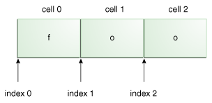

# 正则表达式

- [正则表达式](#正则表达式)
  - [简介](#简介)
  - [匹配内容](#匹配内容)
    - [字符串常量](#字符串常量)
  - [捕获组](#捕获组)
    - [分组编号](#分组编号)
    - [通过编号获取分组（Java）](#通过编号获取分组java)
    - [反向引用](#反向引用)
    - [非捕获组](#非捕获组)
  - [数量词 (quantifiers)](#数量词-quantifiers)
  - [零长度匹配（zero-length matches）](#零长度匹配zero-length-matches)
  - [边界匹配](#边界匹配)
  - [锚点和零宽断言](#锚点和零宽断言)
  - [参考](#参考)

2021-03-13, 12:01
***

## 简介

正则表达式根据特定的规则描述字符串的特征，可用于检索、编辑和操作文本数据。

在 Java 中正则表达式相关的功能在 `java.util.regex`
包中。`java.util.regex`主要包括三个类：`Pattern`, `Matcher`和
`PatternSyntaxException`。

| 对象                   | 功能                               |
|:-----------------------|:-----------------------------------|
| Pattern                | 编译后的正则表达式对象                |
| Matcher                | 解析正则表达式，对输入字符串执行匹配操作 |
| PatternSyntaxException | 表示正则表达式中存在语法错误           |

## 匹配内容

### 字符串常量

匹配字符串常量是正则表达式最基本的匹配模式。例如，正则表达式 "foo"，可以匹配字符串 "foo"：

## 捕获组

捕获组，即将多个字符当作整体处理，用括号进行分组。

使用小括号指定一个捕获组后，匹配这个子表达式的文本可以在表达式或程序中进一步处理。

### 分组编号

每个分组默认会有一个编号，从左右到右，以左括号为标识，第一个出现的分组编号为1，以此类推。

例，`((A)(B(C)))`包含 4 个分组，分别是：
1. `((A)(B(C)))`
2. `(A)`
3. `(B(C))`
4. `(C)`

编号 0 表示整个正则表达式。

### 通过编号获取分组（Java）

通过 `Matcher` 的 `groupCount()` 方法可以获得分组个数（不包括 group 0）。

分组相关方法：

| 方法                 | 功能                                                    |
|:---------------------|:-------------------------------------------------------|
| int start()          | 返回上一个匹配的起始索引                                   |
| int start(int group) | 返回上一个匹配编号对应捕获组匹配到的子字符串在字符串中的起始索引 |
| int end()            | 返回上一个匹配的终止索引                                   |
| int end(int group)   | 返回编号对应捕获组匹配到的子字符串在字符串中的终止索引         |
| group(int group)     | 返回编号对应捕获组匹配到的字符串                            |

### 反向引用

反向引用用于重复搜索前面某个分组匹配到的文本。例如，`\1`表示分组 `1`匹配到的文本。格式：

`\x`

x 表示所引用组的索引。

例：`(\d\d)`定义一个匹配两个数字的捕获组，在表达式后面可以用`\1`引用该捕获组。
因此，`(\d\d)\1`，匹配两个数字后，后面跟着继续匹配两个相同的数字，`1212` 能匹配上，`1234` 匹配不上。

### 非捕获组

语法：`(?:)`

捕获分组，但是不分配编号。

## 数量词 (quantifiers)

数量词用于指定匹配出现的数目。如下表所示：

|Greedy|Reluctant|Possessive|说明|
|---|---|---|---|
|X?|X??|X?+	|X, [0, 1]，匹配0或1次|
|X*|X*?|X*+	|X, [0, ∞]，匹配0或多次|
|X+|X+?|X++	|X, [1, ∞]，至少匹配一次|
|X{n}|X{n}?|X{n}+|X, n，匹配n次|
|X{n,}|X{n, }?|X{n, }+|X, [n, ∞]，至少n次|
|X{n, m}|X{n, m}?|X{n, m}+|X, [n, m], n 到 m次|

解释：
- Greedy, 匹配前读取整个字符串，如果匹配失败，减掉一个字符，再次匹配，重复进行直至匹配成功，或没有字符可减。
- Reluctant, 采用相反的路径，从字符串开头开始匹配，一次递增字符，最后尝试匹配整个字符串。
- Possessive, 直接匹配整个字符串，只尝试一次。

例：`Windows\d+`, 匹配 `Windows`后面跟1个或多个数字。

例：`^\w+`, 匹配一行的第一个单词

例： `[abc]+`, 匹配 `a` 或 `b` 或 `c` 一次或多次

例：`(abc)+`, 匹配 `abc` 一次或多次

## 零长度匹配（zero-length matches）

`a?` 和 `a*` 都可以匹配空字符串，匹配位置 start 和 end 都是 0。因为输入长度为零，这类匹配称为零长度匹配。零长度匹配的情形有多种：
- 输入字符串为空
- 输入字符串起始
- 输入字符串结尾
- 输入字符串中任意挨着的两个字符串之间

零长度匹配很好识别，因为其 start 和 end 索引相同。

## 边界匹配

用于指定在字符串中匹配的位置。

|字符|描述|
|---|---|
|^	|行开头|
|$	|行结尾|
|\b	|匹配单词的边界（开头和结尾）|
|\B	|非单词边界|
|\A	|输入开头|
|\G	|上次匹配的结尾|
|\Z	|The end of the input but for the final terminator, if any|
|\z	|输入结尾|

## 锚点和零宽断言

锚点（Anchors）和零宽断言（zero-width assertions）用于匹配文本中的**位置**，而非文本。

零宽断言：要求文本满足指定条件才继续匹配。

| 格式       | 说明                | 要点    |
| -------- | ----------------- | ----- |
| (?=X)    | 断言匹配位置的右侧满足表达式 X  | 右侧匹配  |
| (?!X)    | 断言匹配位置的右侧不满足表达式 X | 右侧不匹配 |
| (?<=X)   | 断言匹配位置的左侧满足表达式 X  | 左侧匹配  |
| `(?<!X)` | 断言匹配位置的左侧不满足表达式 X | 左侧不匹配 |

说明：
- 正预测，指要求满足指定条件；负预测表示要求不满足指定条件；
- 先行，表示向前搜索；后发，表示向后搜索；
- 零宽度，表示匹配的内容宽度为零，即不匹配任何内容，只是对匹配结果的一个筛选规则。

**(?=X)**

匹配位置右侧满足表达式 `X`。

例如 `foo(?=bar)` 能匹配 `foobar`，不能匹配 `foobaz`。

**(?!X)**

匹配位置右侧不满足表达式 `X`。

例如 `foo(?!bar)` 不匹配 `foobar`，但匹配 `foobaz`

**(?<=X)**

匹配位置左侧满足表达式 `X`。

例如 `(?<=foo)bar` 匹配 `foobar`，不匹配 `fuubar`。

**`(?<!X)`**

同上，但是取否。
## 参考

- <https://docs.oracle.com/javase/tutorial/essential/regex/index.html>
- 正则表达式测试网页工具 [regex101](https://regex101.com/)，**强烈推荐**，好用
