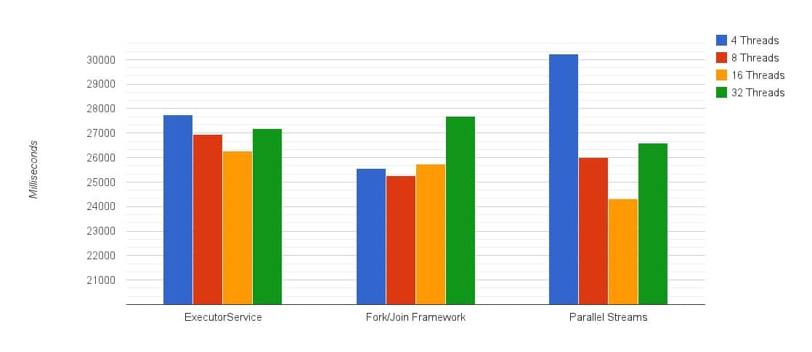
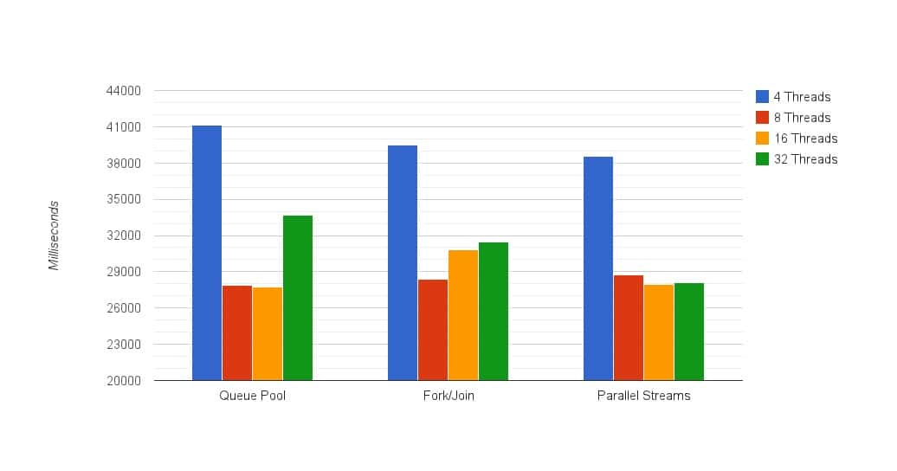

# fork/join vs. parallelStream vs. ExecutorService

## 简介

两个参数：

1. CPU 密集型
2. IO 密集型

在 8 核机器上，采用不同线程数：

- 4
- 8
- 16
- 32

每个测试运行 10 次，取 2-9 次的平均值。

## 索引 5.8 M 行 6GB 的文本

生成一个巨大的文本文件，索引过程采用类似实现，结果如下：

单线程 176,267 毫秒，差不多 3 分钟。

**1. 线程少导致 CPU 利用率低，线程过多额外开销大**

可以看到，最佳性能在 8 线程和 16 线程，因为有些线程会阻塞在文件 IO 步骤，添加比内核更多的线程有助于更好的利用 CPU。而 32 线程，由于创建线程的额外开销，性能更差。

**2. parallelStream 性能最佳，比直接使用 fork/join 快 1 秒**

撇开语法不谈，可以看到 parallelStream 的最佳性能比 fork/join 和 ExecutorService 的最佳性能更好。6 GB 文件索引时间为 24.33 秒。

**3. 性能最差的也是 parallelStream** 

4 线程 parallelStream 是唯一超过 30 秒的情况。当机器可用线程数较少，直接使用 fork/join 比 parallelStream 要快很多（5 秒），两者速度相差 18%。

**4. 在 IO 密集型应用中不要使用默认的 pool-size**

parallelStream 的 pool-size 默认为内核数，这里为 8，这里比 16 线程慢了差不多 2 秒，16% 的性能差异。这是因为 IO 密集型任务会因 IO 阻塞，引入更多线程能够更充分利用 CPU。

如何修改 parallelStream 的 pool-size？可以使用 JVM 参数：-Djava.util.concurrent.ForkJoinPool.common.parallelism=16。

**5. 单线程最慢**

单线程相对最佳结果相差 7.25 倍。机器有 8 核，比较接近理论的 8 倍提升。余下差异可以归因于线程管理消耗。

效果最差的 4 线程 parallelStream，也比单线程快 5.8 倍。

## CPU 密集型任务

这里完全取消 IO，检查一个数是否为素数。19 位数字 1,530,692,068,127,007,263。

这里不使用任何优化，保证所有实现计算量一样。结果如下所示：单线程 118,127 毫秒，越 2 分钟。

**1. 8 线程和 16 线程相差不大**

和 IO 测试不同，这里没有 IO 下号，8 线程和 16 线程的性能接近。fork/join 这里出了点问题，它的 16 线程总是比 8 线程差。进行了多组测试，依然是类似结果。

**2. 最佳结果都近似**

可以看到，不管哪一种实现，最佳结果都是 28 秒左右。

**3. parallelStream 在处理线程过载方面比其它实现好**

16 线程的 parallelStream 性能最佳，此外，parallelStream 在该示例中对所有线程数效果都挺好。

**4. 单线程和最好结果相差 4.2x**

可以发现，在 CPU 密集型任务，最佳效果只有单线程的 4.2x，只有 IO 密集型任务提升的一半。因为 CPU 密集型任务无法像 IO 密集型任务那样，从 IO 阻塞中获益。

## 何时使用 parallelStream

当操作互相独立，并且属于计算密集型任务，推荐使用 parallelStream。具体来说：

- **F**，应用于元素的函数是独立的：对每个元素的计算不依赖或影响其它元素的计算。
- **S**，数据源可以有效分割。
- 串行版本执行时间超过最小阈值。在大多数平台，这个阈值大约为 100 微妙。在实践中，不需要精确地计算，可以将 **N**（元素个数）乘以 **Q**（每个元素执行函数 F 的成本），Q 可以估算为操作数或代码行数，然后看 N*Q 是否超过 10000。当 F 是一个很小的函数，如 `x -> x+1`，那么需要 N>=10000 元素并行才会收益。相反，如果 F 包含大量计算，此时 N 多少无关紧要，只要集合是可拆分的即可。

流框架不会判断，如果计算不是独立的，并行运行没有任何意义，甚至可能出错。主要有以下三个工程问题：

**启动**

随着处理器不断添加内核，大多数处理器还添加了电源控制机制，这会使得内核启动缓慢，还有 JVM，OS 和 hypervisor 的额外开销。这个阈值大致近似于足够多的内核开始处理并行 subtasks 所需的时间。一旦开始运行，并行计算比顺序计算更节能。

**颗粒度**

对已经很小的计算进行细分是不值得的。parallelStream 通常会拆分问题，以便能够充分利用 CPU。如果内核在启动后没做什么工作，那么就浪费了启动时间。现在内核基本在 2 到 256 之间，准确评估 **Q** 有利于避免过度拆分问题。

**可拆分性**

最方便拆分的集合包含 ArrayList, HashMap 以及纯数组。最难拆分的包括 LinkedList, BlockingQueues 以及基于 IO 的资源。其它数据源一般在两者之间。支持随机访问、快速检索的数据结构能够有效分割。如果拆分数据的开销高于处理的开销，那么并发的意义不大。因此，如果 Q 足够大，即使对 LinkedList，并行也能够加速，但这种情况不常见。此外，部分数据源无法完全分解为单个元素，任务的准确划分受限。

收集所有这些详细信息可能很难，但总体效果比较好把握。例如，在一台 32 核测试机器上，在 ArrayList 上运行 max() 或 sum() 这样的小函数，盈亏平衡比较接近 10K：

- 更多的数据能够看到接近 20 倍的明显加速
- 而小于 10K 的数据运行时间不比 10K 的运行时间少多少，通常比串行运行慢。
- 最严重的减速发生在元素少于 100 个的情况，此时会激活一堆线程，但这些线程无事可做，因为计算在它们开始之前就完成了。

另一方面，当每个元素的计算都非常耗时，使用高效且可分割的集合（如 ArrayList）可以获得明显提速。

## 参考

- https://dzone.com/articles/forkjoin-framework-vs-parallel
- https://gee.cs.oswego.edu/dl/html/StreamParallelGuidance.html
- https://blogs.oracle.com/javamagazine/post/java-parallel-streams-performance-benchmark