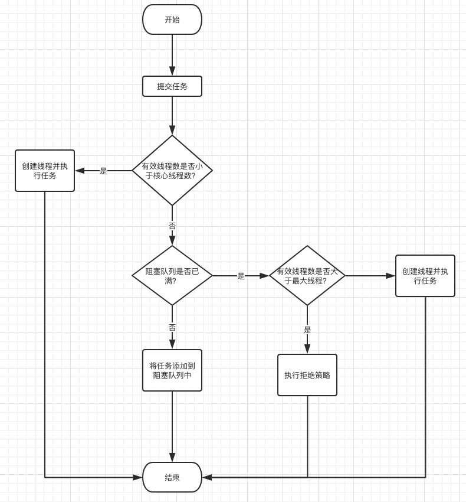

# ThreadPoolExecutor

## 简介

`ThreadPoolExecutor` 类是线程池的具体实现类，该类提供了4个构造函数，其它三个构造函数在下面的构造的基础上提供了部分默认值：

```java
public ThreadPoolExecutor(int corePoolSize,
                            int maximumPoolSize,
                            long keepAliveTime,
                            TimeUnit unit,
                            BlockingQueue<Runnable> workQueue,
                            ThreadFactory threadFactory,
                            RejectedExecutionHandler handler) {
                                // ...
}
```

| 参数 | 说明  |
| -- | --- |
| `corePoolSize`    | 线程池大小。在创建线程池后，默认情况下线程池中没有线程，等待任取到来才创建线程执行任务，当线程池中的线程达到 `corePoolSize` 后，将后续任务放在缓存队列中等待执行；如果调用了 `prestartAllCoreThreads()` 或 `prestartCoreThread()`方法，则在任务到来之前就预创建线程 |
| `maximumPoolSize` | 线程池允许的最大线程数                                                                                                                                                                                                                                                                                                                                                                        |
| `keepAliveTime`   | 线程没有任务执行时最大保持多长时间才终止。默认情况下只有当线程池中的线程数目大于 `corePoolSize` 时 `keepAliveTime` 才起作用，即当线程池中的线程数大于 `corePoolSize` 时，线程空闲的时间达到 `keepAliveTime` 就被终止，直到线程池中的线程数不超过 `corePoolSize`。如果调用了 `allowCoreThreadTimeOut(boolean value)` 方法，在线程池中的线程数不大于 `corePoolSize` 时 `keepAliveTime` 也起作用 |
| `unit`            | `keepAliveTime` 的时间单位                                                                                                                                                                                                                                                                                                                                                                    |
| `workQueue`       | 当前线程数超过 `corePoolSize` 时，新的任务会处于等待状态，并保存在该阻塞队列中                                                                                                                                                                                                                                                                                                                |
| `threadFactory`   | 线程工长，用于创建线程                                                                                                                                                                                                                                                                                                                                                                        |
| `handler`         | 拒绝处理任务时采取的策略                                                                                                                                                                                                                                                                                                                                                                      |

> `largestPoolSize` 字段用于记录线程池中曾出现的最大线程数目。

## workQueue

如果线程数目超过了 `corePoolSize`，后续的任务放在阻塞队列中，该阻塞队列一般选择以下几种类型：
- `ArrayBlockingQueue`
- `DelayQueue`
- `LinkedBlockingQueue`
- `PriorityBlockingQueue`
- `SynchronousQueue`

`ArrayBlockingQueue`  
内部实现为数组，有固定大小，初始化后大小不再变化。

`DelayQueue`  
阻塞的是其内部元素，`DelayQueue` 中的元素必须实现 `java.util.concurrent.Delayed` 接口，该接口只有一个方法 `long getDelay(TimeUnit unit)`，返回值是队列元素被释放前的保留时间，返回 0 或者负值表示该元素已经到期需要被释放，此时 `DelayedQueue` 通过其 `take()` 方法释放此对象，`DelayQueue` 可应用于定时关闭连接、缓存对象，超时处理等各种场景；

`LinkedBlockingQueue`  
阻塞队列的大小是可选的，如果初始化时指定一个大小，它就是有边界的，如果不指定，它就是无边界的。无边界其实是采用了默认大小Integer.MAX_VALUE。其内部实现是一个链表。

`PriorityBlockingQueue`  
是一个没有边界的队列，它的排序规则和 `java.util.PriorityQueue` 一样。需要注意，`PriorityBlockingQueue` 中允许插入null对象。所有插入 `PriorityBlockingQueue` 的对象必须实现 `java.lang.Comparable` 接口，队列优先级的排序规则就是按照我们对这个接口的实现来定义的。

`SynchronousQueue`  
队列内部仅允许容纳一个元素。当一个线程插入一个元素后会被阻塞，除非这个元素被另一个线程消费。

一般使用 `LinkedBlockingQueue`，大小设置为有边界，避免内存溢出。

## threadFactory
用于创建线程的工厂类，`Executors`里默认的 `threadFactory` 里线程的默认命名规则为 "pool-num-thread-num".

## handler

当运行的线程数目达到 `maximumPoolSize`，并且 `workQueue` 有界且已满，这时提交新的任务通过 handler 策略处理。

handle 有以下几种取值：
| handle 策略                              | 说明                                                     |
| ---------------------------------------- | -------------------------------------------------------- |
| `ThreadPoolExecutor.AbortPolicy`         | 默认值，丢弃任务并抛出`RejectedExecutionException`异常   |
| `ThreadPoolExecutor.DiscardPolicy`       | 丢弃任务，但是不抛出异常                                 |
| `ThreadPoolExecutor.DiscardOldestPolicy` | 丢弃队列最前面的任务，然后重新尝试执行任务（重复此过程） |
| `ThreadPoolExecutor.CallerRunsPolicy`    | 由调用线程处理该任务                                     |

还可以自定义拒绝策略，只需要实现 `RejectedExecutionHandler` 接口。

## 核心方法

| 方法                                            | 说明                                                                                                                                               |
| ----------------------------------------------- | -------------------------------------------------------------------------------------------------------------------------------------------------- |
| `execute()`                                     | 向线程池提交任务                                                                                                                                   |
| `submit()`                                      | 先线程池提交任务，和 `execute()` 不同的时，它可以返回执行结果                                                                                      |
| `getPoolSize()`                                 | 获得线程池大小                                                                                                                                     |
| `getActiveCount()`                              | 线程池中正在执行任务线程的数量                                                                                                                         |
| `getCompletedTaskCount()`                       | 获得执行器完成的任务数量                                                                                                                           |
| `getLargestPoolSize()`                          | 返回曾经同时位于线程池中的最大线程数                                                                                                               |
| `shutdownNow()`                                 | 立即关闭执行器。执行器不再执行那些正在等待执行的任务，该方法返回等待执行的任务列表。调用时，正在执行的任务将继续执行，但该方法并不等待这些任务完成 |
| `isTerminated()`                                | 如果调用了 `shutdown()` 或 `shutdownNow()`，并且执行器完成了关闭，该方法返回 true                                                      |
| `isShutdown()`                                  | 如果调用了 shutdown()，该方法返回 true                                                                                                             |
| `awaitTermination(long timeout, TimeUnit unit)` | 这个方法阻塞所调用的线程，直到执行器完成任务或者达到所指定的 timeout 值                                                                            |
| `getTaskCount()`                                | 返回发送给执行器任务的数目                                                                                                                         |
| `prestartAllCoreThreads()`                      | 创建线程池后调用该方法，可以预先创建 `corePoolSize` 数目的线程                                                                                     |
| `prestartCoreThread`                            | 预先创建线程，不过只创建一条线程                                                                                                                   |

## 执行流程
通过 `execute()` 方法提交任务，线程池通过如下流程安排新的任务：



1. 刚创建的线程池，里面没有线程，不过可以通过 `prestartCoreThread()` 或 `prestartAllCoreThreads()` 预先创建线程
2. 当调用 `execute()` 方法添加一个新任务时，线程池会作如下判断：
   - 如果正在运行的线程数小于 `corePoolSize`，则创建线程执行该任务；
   - 如果正在运行的线程数大于或等于 `corePoolSize`，但队列 `workQueue`未满，那么将该任务放入队列，按照FIFO的顺序执行；
   - 如果队列已满，而正在运行的线程数目小于 `maximumPoolSize`，则创建线程执行该任务；
   - 如果队列已满，且正在运行的线程数目大于或等于 `maximumPoolSize`，那么线程池会给 `RejectedExecutionHandler` 作拒绝处理。
3. 当一个线程执行结束，线程池从队列中取下一个任务执行。
4. 当一个线程无所事事超过一段时间（`keepAliveTime`），如果当前运行的线程数目大于 `corePoolSize`，线程池会关掉这个线程。

`submit()` 也是提交任务的方法，和 `execute()` 不同的是，它可以返回任务执行的结果：其内部调用 `execute()` 方法执行任务，通过 `Future()` 获得结果。

小结一下：在线程池中执行任务比为每个任务分配一个线程优势更多，通过重用现有的线程而不是创建新线程，可以在处理多个请求时分摊线程创建和销毁产生的巨大的开销。当请求到达时，通常工作线程已经存在，提高了响应性；通过配置线程池的大小，可以创建足够多的线程使CPU达到忙碌状态，还可以防止线程太多耗尽计算机的资源。

## 回收核心线程？

你可能会想到将 `corePoolSize` 的数量设置为0，从而线程池的所有线程都是“临时”的，只有 `keepAliveTime` 存活时间，你的思路也许时正确的，但你有没有想过一个很严重的后果，`corePoolSize=0` 时，任务需要填满阻塞队列才会创建线程来执行任务，阻塞队列有设置长度还好，如果队列长度无限大呢，你就等着OOM异常吧，所以用这种设置行为并不是我们所需要的。

