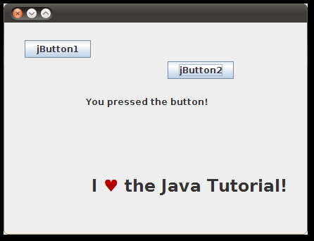
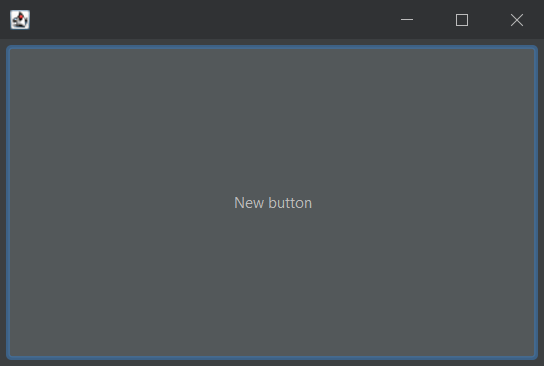
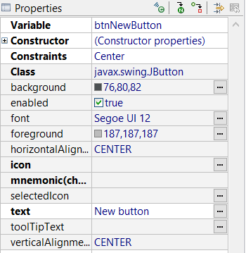
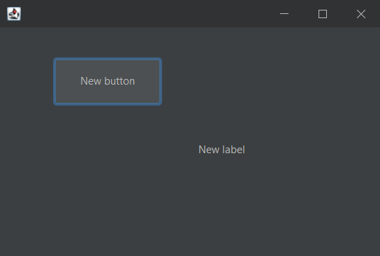

# JavaBeans 快速入门

- [JavaBeans 快速入门](#javabeans-快速入门)
  - [简介](#简介)
  - [创建项目](#创建项目)
  - [Button 是 Bean](#button-是-bean)
    - [属性](#属性)
    - [Event](#event)
  - [连接程序](#连接程序)

## 简介

下面构建一个简单的程序，使用 JavaBeans 组件构建如下的图像应用。



## 创建项目

首先创建一个 Java 项目，在其中创建 `JFrame`，下面用 Eclipse 的 WindowBuilder 创建，如下：

```java
public class SnapFrame extends JFrame{

    private JPanel contentPane;

    /**
     * Launch the application.
     */
    public static void main(String[] args){
        EventQueue.invokeLater(new Runnable()
        {
            public void run()
            {
                try {
                    SnapFrame frame = new SnapFrame();
                    frame.setVisible(true);
                } catch (Exception e) {
                    e.printStackTrace();
                }
            }
        });
    }

    /**
     * Create the frame.
     */
    public SnapFrame()
    {
        setDefaultCloseOperation(JFrame.EXIT_ON_CLOSE);
        setBounds(100, 100, 450, 300);
        contentPane = new JPanel();
        contentPane.setBorder(new EmptyBorder(5, 5, 5, 5));
        contentPane.setLayout(new BorderLayout(0, 0));
        setContentPane(contentPane);
    }
}
```

## Button 是 Bean

所有的 Swing 组件都是 bean。添加一个 `JButton` 到按钮，如下：



### 属性



更改 bean 的属性，可以更改其外观或内部属性。`JButton` 是 bean，其属性包括前景色、字体、出现在按钮上的文本等。

### Event

Bean 可以触发事件。在事件窗口可以看到按钮能触发的事件列表：


我们继续下一步事件处理，我们添加一个 `JLabel` 到UI中，如下：



## 连接程序

