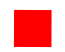
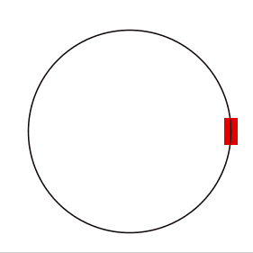
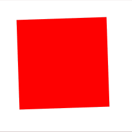

# Transition

2023-07-31, 11:41
****
## 1. 简介

使用 Timeline 需要设置 keyframes，使用起来相对麻烦。例如，创建 keyframes 并设置 Timeline 让 node 沿着圆移动就不容易实现。JavaFX 提供了许多类，可以使用预定义属性对 node 实现动画，这些类就是 transition。

所有 transition 都继承 Transition 类，而 Transition 又继承自 Animation，所以 Animation 的属性很方法在 Transition 也能用。

使用 Transition 只需要设置 node、duration 和 end-value。

Animation 的 interpolator 属性指定插值器。默认为 `Interpolator.EASE_BOTH`。

## 2. FadeTransition

FadeTransition 类在指定时间内逐渐增加或减少 node `opacity` 实现淡入或淡出效果。该类定义了如下属性来指定动画：

- duration：指定一个动画周期的持续时间
- node：该 node 的 `opacity` 属性被修改
- fromValue：`opacity` 的初始值，如果不指定，使用 node 当前 `opacity`
- toValue：`opacity` 的端点值，动画期间，node 的 `opacity` 在 `fromValue` 和 `toValue` 之间变化
- byValue：指定 opacity 端点值的另一种方式，此时 endValue=fromValue+byValue

如果同时指定 toValue 和 byValue，则使用 toValue。

例如，假设你想在动画中将 node 的 opacity 设置在 1.0 到 0.5 之间。那么可以设置 fromValue 为 1.0，toValue 为 0.5；也可以设置 fromValue 为 1.0，byValue 为 -0.50.

opacity 有效值在 0.0 到 1.0 之间，超出该范围 FadeTransition 会自动截断。

**示例：** 为 Rectangle 实现淡出效果，在 2 秒内 opacity 从 1.0 到 0.2

```java
Rectangle rect = new Rectangle(200, 50, Color.RED);
FadeTransition fadeInOut = new FadeTransition(Duration.seconds(2), rect);
fadeInOut.setFromValue(1.0);
fadeInOut.setToValue(.20);
fadeInOut.play();
```

**示例：** 为 Rectangle 实现淡出和淡入动画的无效循环

```java
import javafx.animation.FadeTransition;
import javafx.application.Application;
import javafx.scene.Scene;
import javafx.scene.layout.HBox;
import javafx.scene.paint.Color;
import javafx.scene.shape.Rectangle;
import javafx.stage.Stage;
import javafx.util.Duration;

public class FadeTest extends Application {

    public static void main(String[] args) {
        Application.launch(args);
    }

    @Override
    public void start(Stage stage) {
        Rectangle rect = new Rectangle(200, 50, Color.RED);
        HBox root = new HBox(rect);
        Scene scene = new Scene(root);
        stage.setScene(scene);
        stage.setTitle("Fade-in and Fade-out");
        stage.show();

        // Set up a fade-in and fade-out animation for the rectangle
        FadeTransition fadeInOut = new FadeTransition(Duration.seconds(2), rect);
        fadeInOut.setFromValue(1.0);
        fadeInOut.setToValue(.20);
        fadeInOut.setCycleCount(FadeTransition.INDEFINITE);
        fadeInOut.setAutoReverse(true);
        fadeInOut.play();
    }
}
```


## 3. FillTransition

`FillTransition` 通过在指定范围和 duration 逐步改变 `Shape` 的 `fill` 属性实现填充过度效果。

该类定义了如下属性来定义动画：

- duration：指定一个动画周期的持续时间
- shape：`fill` 属性被更改的 Shape
- fromValue：初始 `fill` 值，默认为 Shape 的当前 `fill`
- toValue：末端 `fill` 值

在一个动画周期，Shape 的 `fill` 属性从 fromValue 到 toValue。

Shape 的 fill 属性为 Paint 类型，而 fromValue 和 toValue 为 Color 类型，即 FillTransition 只支持 Color 渐变。

**示例：** Rectangle 的 fill 属性在 2 秒内从 blueviolet 变为 blue

```java
FillTransition fillTransition = new FillTransition(Duration.seconds(2), rect);
fillTransition.setFromValue(Color.BLUEVIOLET);
fillTransition.setToValue(Color.AZURE);
fillTransition.play();
```

**示例：** 上个示例的完整实现

```java
import javafx.animation.FillTransition;
import javafx.application.Application;
import javafx.scene.Scene;
import javafx.scene.layout.HBox;
import javafx.scene.paint.Color;
import javafx.scene.shape.Rectangle;
import javafx.stage.Stage;
import javafx.util.Duration;

public class FillTest extends Application {

    public static void main(String[] args) {
        Application.launch(args);
    }

    @Override
    public void start(Stage stage) {
        Rectangle rect = new Rectangle(200, 50, Color.RED);
        HBox root = new HBox(rect);
        Scene scene = new Scene(root);
        stage.setScene(scene);
        stage.setTitle("Fill Transition");
        stage.show();

        // Set up a fill transition for the rectangle
        FillTransition fillTransition = new FillTransition(Duration.seconds(2), rect);
        fillTransition.setFromValue(Color.BLUEVIOLET);
        fillTransition.setToValue(Color.AZURE);
        fillTransition.setCycleCount(FillTransition.INDEFINITE);
        fillTransition.setAutoReverse(true);
        fillTransition.play();
    }
}
```


## 4. StrokeTransition

StrokeTransition 实现 `stroke` 属性的动画，与 FillTransition 的使用基本一致。

StrokeTransition 定义的属性与 FillTransition 一样，即：

- duration：指定一个动画周期的持续时间
- shape：`stroke` 属性被更改的 Shape
- fromValue：初始 `stroke` 值，默认为 Shape 的当前 `stroke`
- toValue：末端 `stroke` 值

**示例：** Rectangle 的 stroke 动画，stroke 从 red 到 blue，2 秒一个周期

```java
Rectangle rect = new Rectangle(200, 50, Color.WHITE);
StrokeTransition strokeTransition = 
                    new StrokeTransition(Duration.seconds(2), rect);
strokeTransition.setFromValue(Color.RED);
strokeTransition.setToValue(Color.BLUE);
strokeTransition.setCycleCount(StrokeTransition.INDEFINITE);
strokeTransition.setAutoReverse(true);
strokeTransition.play();
```

## 5. TranslateTransition

`TranslateTransition`  类对 Node 的 `translateX`, `translateY` 和 `translateZ` 属性实现动画。该类定义了如下属性：

- duration：指定一个动画周期的持续时间
- node
- fromX
- fromY
- fromZ
- toX
- toY
- toZ
- byX
- byY
- byZ

(fromX, fromY, fromZ) 指定 node 初始位置，默认为 (translateX, translateY, translateZ)。

(toX, toY, toZ) 指定端点位置。

(byX, byY, byZ) 为另一种指定端点的方式：

```java
translateX_end_value = translateX_initial_value + byX
translateY_end_value = translateY_initial_value + byY
translateZ_end_value = translateZ_initial_value + byZ
```

同时指定 (toX, toY, toZ) 和 (byX, byY, byZ)，前者优先。

**示例：** Text 滚动效果

```java
import javafx.animation.TranslateTransition;
import javafx.application.Application;
import javafx.geometry.VPos;
import javafx.scene.Scene;
import javafx.scene.layout.Pane;
import javafx.scene.text.Font;
import javafx.scene.text.Text;
import javafx.stage.Stage;
import javafx.util.Duration;

public class TranslateTest extends Application {

    public static void main(String[] args) {
        Application.launch(args);
    }

    @Override
    public void start(Stage stage) {
        Text msg = new Text("JavaFX animation is cool!");
        msg.setTextOrigin(VPos.TOP);
        msg.setFont(Font.font(24));

        Pane root = new Pane(msg);
        root.setPrefSize(500, 70);
        Scene scene = new Scene(root);

        stage.setScene(scene);
        stage.setTitle("Scrolling Text using a Translate Transition");
        stage.show();

        // Set up a translate transition for the Text object
        TranslateTransition tt = new TranslateTransition(Duration.seconds(2), msg);
        tt.setFromX(scene.getWidth());
        tt.setToX(-1.0 * msg.getLayoutBounds().getWidth());
        tt.setCycleCount(TranslateTransition.INDEFINITE);
        tt.setAutoReverse(true);
        tt.play();
    }
}
```


## 6. RotateTransition

RotateTransition 类通过 Node 的 rotate 属性实现旋转动画。Node 沿着指定轴围绕 Node 的中心旋转。

RotateTransition 通过如下属性指定动画：

- duration
- node
- axis
- fromAngle
- toAngle
- byAngle

duration 属性指定一个动画周期持续的时间。

`node` 属性指定 `rotate` 属性发生变化的 `Node`。

`axis` 属性指定旋转的坐标轴。默认为 `rotationAxis` 属性的默认值 `Rotate.Z_AXIS`。可用值包括 `Rotate.X_AXIS`, `Rotate.Y_AXIS`, `Rotate.Z_AXIS`。

fromAngle 属性指定旋转的初始角度。默认为 Node 的 rotate 属性值。

toAngle 指定端点角度。

byAngle 也用于指定端点角度：

```java
rotation_end_value = rotation_initial_value + byAngle
```

如果同时指定 toAngle 和 byAngle，前者优先。

所有角度单位为度数。0° 对应三点钟方向，正数指顺时针方向。

**示例：** Rectangle 的旋转动画

Rectangle 顺时针和逆时针交替旋转。

```java
import javafx.animation.RotateTransition;
import javafx.application.Application;
import javafx.geometry.Insets;
import javafx.scene.Scene;
import javafx.scene.layout.HBox;
import javafx.scene.paint.Color;
import javafx.scene.shape.Rectangle;
import javafx.stage.Stage;
import javafx.util.Duration;

public class RotateTest extends Application {

    public static void main(String[] args) {
        Application.launch(args);
    }

    @Override
    public void start(Stage stage) {
        Rectangle rect = new Rectangle(50, 50, Color.RED);
        HBox.setMargin(rect, new Insets(20));
        HBox root = new HBox(rect);
        Scene scene = new Scene(root);
        stage.setScene(scene);
        stage.setTitle("Rotate Transition");
        stage.show();

        // Set up a rotate transition the rectangle
        RotateTransition rt = new RotateTransition(Duration.seconds(2), rect);
        rt.setFromAngle(0.0);
        rt.setToAngle(360.0);
        rt.setCycleCount(RotateTransition.INDEFINITE);
        rt.setAutoReverse(true);
        rt.play();
    }
}
```



## 7. ScaleTransition

ScaleTransition 类通过 Node 的 scaleX, scaleY 和 scaleZ 属性实现缩放动画。

该类通过如下属性指定动画：

- duration
- node
- fromX
- fromY
- fromZ
- toX
- toY
- toZ
- byX
- byY
- byZ

`duration` 属性指定一个动画周期持续时间。

`node` 属性指定 `scaleX`, `scaleY`, `scaleZ` 属性发生变化的 `Node`。

(fromX, fromY, fromZ) 指定 Node 的初始缩放值，默认为 Node 的 (scaleX, scaleY, scaleZ) 属性。

(toX, toY, toZ) 指定端点值。

(byX, byY, byZ) 按如下方式指定端点值：

```java
scaleX_end_value = scaleX_initial_value + byX
scaleY_end_value = scaleY_initial_value + byY
scaleZ_end_value = scaleZ_initial_value + byZ
```

同时指定 (toX, toY, toZ) 和 (byX, byY, byZ)，前者优先。

**示例：** Rectangle 缩放动画


```java
import javafx.animation.ScaleTransition;
import javafx.application.Application;
import javafx.scene.Scene;
import javafx.scene.layout.HBox;
import javafx.scene.paint.Color;
import javafx.scene.shape.Rectangle;
import javafx.stage.Stage;
import javafx.util.Duration;

public class ScaleTest extends Application {

    public static void main(String[] args) {
        Application.launch(args);
    }

    @Override
    public void start(Stage stage) {
        Rectangle rect = new Rectangle(200, 50, Color.RED);
        HBox root = new HBox(rect);
        Scene scene = new Scene(root);
        stage.setScene(scene);
        stage.setTitle("Scale Transition");
        stage.show();

        // Set up a scale transition for the rectangle
        ScaleTransition st = new ScaleTransition(Duration.seconds(2), rect);
        st.setFromX(1.0);
        st.setToX(0.20);
        st.setFromY(1.0);
        st.setToY(0.20);
        st.setCycleCount(ScaleTransition.INDEFINITE);
        st.setAutoReverse(true);
        st.play();
    }
}
```


## 8. PathTransition

PathTransition 类通过 Node 的 translateX 和 translateY 属性，让 Node 在指定路径移动。移动路径由 Shape 定义。

PathTransition 使用如下属性定义动画：

- duration
- node
- path
- orientation

`path` 属性定义 node 移动的路经，为 Shape 类型。可以使用 Shape 任意子类，如 Arc, Circle, Rectangle, Ellipse, Path, SVGPath 等。

node 可以一直保持竖直，也可以随着运动旋转，从而一直与路径的切线垂直。`orientation` 属性指定该行为，为 `PathTransition.OrientationType` 类型：`NONE`, `ORTHOGONAL_TO_TANGENT`

- 默认 NONE，表示一直保持竖直
- ORTHOGONAL_TO_TANGENT 表示与路径的切线垂直

下图是 Rectangle 沿着 Circle 移动的 PathTransition 实现。


构造函数：

```java
PathTransition()
PathTransition(Duration duration, Shape path)
PathTransition(Duration duration, Shape path, Node node)
```

**示例：** Rectangle 用沿着 Circle 运动

```java
import javafx.animation.PathTransition;
import javafx.application.Application;
import javafx.scene.Group;
import javafx.scene.Scene;
import javafx.scene.paint.Color;
import javafx.scene.shape.Circle;
import javafx.scene.shape.Rectangle;
import javafx.stage.Stage;
import javafx.util.Duration;

public class PathTest extends Application {

    public static void main(String[] args) {
        Application.launch(args);
    }

    @Override
    public void start(Stage stage) {
        // Create the node
        Rectangle rect = new Rectangle(20, 10, Color.RED);

        // Create the path
        Circle path = new Circle(100, 100, 100);
        path.setFill(null);
        path.setStroke(Color.BLACK);

        Group root = new Group(rect, path);
        Scene scene = new Scene(root);
        stage.setScene(scene);
        stage.setTitle("Path Transition");
        stage.show();

        // Set up a path transition for the rectangle
        PathTransition pt = new PathTransition(Duration.seconds(2), path, rect);
        pt.setOrientation(PathTransition.OrientationType.ORTHOGONAL_TO_TANGENT);
        pt.setCycleCount(PathTransition.INDEFINITE);
        pt.setAutoReverse(true);
        pt.play();
    }
}
```


## 9. PauseTransition

PauseTransition 类定义暂停，不单独使用，而是在 `SequentialTransition` 中在两个动画之间插入暂停。duration 属性指定暂停时间。

如果希望在动画结束后指定时间执行 ActionEvent  handler，可以用 PauseTransition 实现。使用 Animation 类的 onFinished 属性即可。

创建 PauseTransition：

```java
// Create a pause transition of 400 milliseconds that is the default duration
PauseTransition pt1 = new PauseTransition();

// Change the duration to 10 seconds
pt1.setDuration(Duration.seconds(10));

// Create a pause transition of 5 seconds
PauseTransition pt2 = new PauseTransition(Duration.seconds(5));
```

## 10. SequentialTransition

`SequentialTransition` 类按顺序执行一系列动画。支持 Transition 和 Timeline。

SequentialTransition 的 node 属性指定默认动画对象。如果所有的动画都指定了 node，则忽略该属性。

SequentialTransition.getChildren() 返回 `ObservableList<Animation>`，定义动画序列。

**示例：** SequentialTransition

- 创建 3 个 transition: FadeTransition, PauseTransition, PathTransition
- SequentialTransition 播放时，这个三个动画会依次播放。

```java
FadeTransition fadeTransition = ...
PauseTransition pauseTransition = ...
PathTransition pathTransition = ...

SequentialTransition st = new SequentialTransition();
st.getChildren().addAll(fadeTransition, pauseTransition, pathTransition);
st.play();
```

**示例：** SequentialTransition

创建 ScaleTransition, FillTransition, PauseTransition, PathTransition 序列：

- 将 Rectangle 放大一倍，然后缩小到原来尺寸
- 将 Rectangle 填充色从 red 变为 blue，然后再变为 red
- 暂停 200 毫秒，在 stdout 输出一条消息
- 沿着 Circle 移动 Rectangle
- 循环

```java
import javafx.animation.*;
import javafx.application.Application;
import javafx.scene.Scene;
import javafx.scene.layout.Pane;
import javafx.scene.paint.Color;
import javafx.scene.shape.Circle;
import javafx.scene.shape.Rectangle;
import javafx.stage.Stage;
import javafx.util.Duration;

import static javafx.animation.PathTransition.OrientationType.ORTHOGONAL_TO_TANGENT;

public class SequentialTest extends Application {

    public static void main(String[] args) {
        Application.launch(args);
    }

    @Override
    public void start(Stage stage) {
        // Create the node to be animated
        Rectangle rect = new Rectangle(20, 10, Color.RED);

        // Create the path
        Circle path = new Circle(100, 100, 75);
        path.setFill(null);
        path.setStroke(Color.BLACK);

        Pane root = new Pane(rect, path);
        root.setPrefSize(200, 200);
        Scene scene = new Scene(root);
        stage.setScene(scene);
        stage.setTitle("Sequential Transition");
        stage.show();

        // Set up a scale transition
        ScaleTransition scaleTransition = 
                            new ScaleTransition(Duration.seconds(1));
        scaleTransition.setFromX(1.0);
        scaleTransition.setToX(2.0);
        scaleTransition.setFromY(1.0);
        scaleTransition.setToY(2.0);
        scaleTransition.setCycleCount(2);
        scaleTransition.setAutoReverse(true);

        // Set up a fill transition
        FillTransition fillTransition = new FillTransition(Duration.seconds(1));
        fillTransition.setFromValue(Color.RED);
        fillTransition.setToValue(Color.BLUE);
        fillTransition.setCycleCount(2);
        fillTransition.setAutoReverse(true);

        // Set up a pause transition
        PauseTransition pauseTransition = 
                            new PauseTransition(Duration.millis(200));
        pauseTransition.setOnFinished(e -> System.out.println("Ready to circle..."));

        // Set up a path transition
        PathTransition pathTransition = 
                            new PathTransition(Duration.seconds(2), path);
        pathTransition.setOrientation(ORTHOGONAL_TO_TANGENT);

        // Create a sequential transition
        SequentialTransition st = new SequentialTransition();

        // Rectangle is the node for all animations
        st.setNode(rect);

        // Add animations to the list
        st.getChildren().addAll(scaleTransition,
                fillTransition,
                pauseTransition,
                pathTransition);
        st.setCycleCount(PathTransition.INDEFINITE);
        st.play();
    }
}
```



## 11. ParallelTransition

`ParallelTransition` 表示并行动画。即同时播放多个动画。

`ParallelTransition` 的 `node` 属性指定默认动画对象。如果所有动画都指定了 `node`，则忽略该属性。

`ParallelTransition.getChildren()` 返回 `ObservableList<Animation>`，为动画列表。

**示例：** ParallelTransition

- 创建 FadeTransition 和 PathTransition
- 在 ParallelTransition 同时播放

```java
FadeTransition fadeTransition = ...
PathTransition pathTransition = ...

ParallelTransition pt = new ParallelTransition();
pt.getChildren().addAll(fadeTransition, pathTransition);
pt.play();
```

**示例：** ParallelTransition

FadeTransition 和 RotateTransition 同时播放

```java
import javafx.animation.FadeTransition;
import javafx.animation.ParallelTransition;
import javafx.animation.PathTransition;
import javafx.animation.RotateTransition;
import javafx.application.Application;
import javafx.geometry.Insets;
import javafx.scene.Scene;
import javafx.scene.layout.HBox;
import javafx.scene.paint.Color;
import javafx.scene.shape.Rectangle;
import javafx.stage.Stage;
import javafx.util.Duration;

public class ParallelTest extends Application {

    public static void main(String[] args) {
        Application.launch(args);
    }

    @Override
    public void start(Stage stage) {
        Rectangle rect = new Rectangle(100, 100, Color.RED);
        HBox.setMargin(rect, new Insets(20));

        HBox root = new HBox(rect);
        Scene scene = new Scene(root);
        stage.setScene(scene);
        stage.setTitle("Parallel Transition");
        stage.show();

        // Set up a fade transition
        FadeTransition fadeTransition = new FadeTransition(Duration.seconds(1));
        fadeTransition.setFromValue(0.20);
        fadeTransition.setToValue(1.0);
        fadeTransition.setCycleCount(2);
        fadeTransition.setAutoReverse(true);

        // Set up a rotate transition
        RotateTransition rotateTransition =
                new RotateTransition(Duration.seconds(2));
        rotateTransition.setFromAngle(0.0);
        rotateTransition.setToAngle(360.0);
        rotateTransition.setCycleCount(2);
        rotateTransition.setAutoReverse(true);

        // Create and start a sequential transition
        ParallelTransition pt = new ParallelTransition();

        // Rectangle is the node for all animations
        pt.setNode(rect);
        pt.getChildren().addAll(fadeTransition, rotateTransition);
        pt.setCycleCount(PathTransition.INDEFINITE);
        pt.play();
    }
}
```



