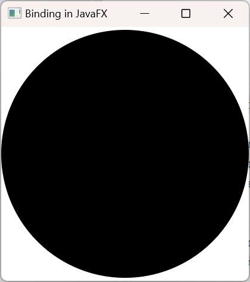

# 使用绑定将 Circle 居中

2023-06-28, 15:17
****
这是在 GUI 中使用绑定的一个简单例子。

创建一个带 `Circle` 的 `Scene`，`Circle` 在 `Scene` 中总是居中，即使调整 `Scene` 尺寸，`Circle` 也保持居中。`Circle` 的半径会随着 `Scene` 变化而调整，总是挨着 `Scene` 边界。

使用 binding 很容易实现该功能。`javafx.scene.shape` 包中的 `Circle` 表示圆，它包含三个属性：`centerX`, `centerY` 和 `radius`，均为 `DoubleProperty` 类型。

```java
import javafx.application.Application;
import javafx.beans.binding.Bindings;
import javafx.scene.Group;
import javafx.scene.Scene;
import javafx.scene.shape.Circle;
import javafx.stage.Stage;

public class CenteredCircle extends Application {

    public static void main(String[] args) {
        Application.launch(args);
    }

    @Override
    public void start(Stage stage) {
        Circle c = new Circle();
        Group root = new Group(c);
        Scene scene = new Scene(root, 100, 100);

        // Bind the centerX, centerY, and radius to the scene width and height
        c.centerXProperty().bind(scene.widthProperty().divide(2));
        c.centerYProperty().bind(scene.heightProperty().divide(2));
        c.radiusProperty().bind(Bindings.min(scene.widthProperty(),
                        scene.heightProperty())
                .divide(2));

        // Set the stage properties and make it visible
        stage.setTitle("Binding in JavaFX");
        stage.setScene(scene);
        stage.sizeToScene();
        stage.show();
    }
}
```

