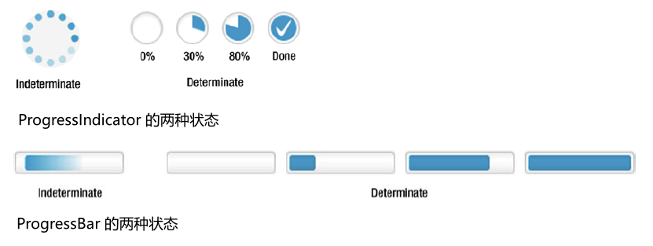

# 任务进度

2023-07-24, 21:10
****
## 1. 简介

JavaFX 提供了两个显示进度的控件：

- ProgressIndicator
- ProgressBar

它们只是在显示进度的方式上不同。ProgressBar 继承 ProgressIndicator。`ProgressIndicator` 以圆形控件中显示进度，而 `ProgressBar` 使用长条。如下图所示：

- ProgressIndicator 的确定和不确定状态
- ProgressBar 的确定和不确定状态



## 2. 进度

任务进度分为两种状态，确定和不确定。如果无法确定进度，称其处于 `indeterminate` 状态。`ProgressIndicator` 声明了两个属性：

- indeterminate
- progress

`indeterminate` 是 read-only 的 boolean 属性，`true` 表示无法确定进度，此时 `ProgressIndicator` 展示循环的动画。

`progress` 属性是 `double` 类型。其值表示进度在 0% ~ 100% 之间，**负数表示进度不确**定。0 到 1.0 之间对应正常进度，大于 1.0 则视为 1.0 (100%)。

`ProgressIndicator` 和 `ProgressBar` 的默认构造函数创建的控件均处于不确定状态：

```java
// Create an indeterminate progress indicator and a progress bar
ProgressIndicator indeterminateInd = new ProgressIndicator();
ProgressBar indeterminateBar = new ProgressBar();
```

以非负数为参数的构造函数，创建以指定进度开始的控件，处于确定状态；如果进度为负值，则处于不确定状态。

```java
// Create a determinate progress indicator with 10% progress
ProgressIndicator indeterminateInd = new ProgressIndicator(0.10);

// Create a determinate progress bar with 70% progress
ProgressBar indeterminateBar = new ProgressBar(0.70);
```

**示例：** ProgressIndicator 和 ProgressBar

- 点击 "Make Progress" 进度增加 10%
- 点击 "Complete Task" 完成不确定任务，将其进度设置为 100%

```java
import javafx.application.Application;
import javafx.scene.Scene;
import javafx.scene.control.Button;
import javafx.scene.control.Label;
import javafx.scene.control.ProgressBar;
import javafx.scene.control.ProgressIndicator;
import javafx.scene.layout.GridPane;
import javafx.stage.Stage;

public class ProgressTest extends Application {

    public static void main(String[] args) {
        Application.launch(args);
    }

    @Override
    public void start(Stage stage) {
        ProgressIndicator indeterminateInd = new ProgressIndicator();
        ProgressIndicator determinateInd = new ProgressIndicator(0);

        ProgressBar indeterminateBar = new ProgressBar();
        ProgressBar determinateBar = new ProgressBar(0);

        Button completeIndBtn = new Button("Complete Task");
        completeIndBtn.setOnAction(e -> indeterminateInd.setProgress(1.0));

        Button completeBarBtn = new Button("Complete Task");
        completeBarBtn.setOnAction(e -> indeterminateBar.setProgress(1.0));

        Button makeProgresstIndBtn = new Button("Make Progress");
        makeProgresstIndBtn.setOnAction(e -> makeProgress(determinateInd));

        Button makeProgresstBarBtn = new Button("Make Progress");
        makeProgresstBarBtn.setOnAction(e -> makeProgress(determinateBar));

        GridPane root = new GridPane();
        root.setHgap(10);
        root.setVgap(5);
        root.addRow(0, new Label("Indeterminate Progress:"),
                indeterminateInd, completeIndBtn);
        root.addRow(1, new Label("Determinate Progress:"),
                determinateInd, makeProgresstIndBtn);
        root.addRow(2, new Label("Indeterminate Progress:"),
                indeterminateBar, completeBarBtn);
        root.addRow(3, new Label("Determinate Progress:"),
                determinateBar, makeProgresstBarBtn);
        root.setStyle("-fx-padding: 10;" +
                "-fx-border-style: solid inside;" +
                "-fx-border-width: 2;" +
                "-fx-border-insets: 5;" +
                "-fx-border-radius: 5;" +
                "-fx-border-color: blue;");

        Scene scene = new Scene(root);
        stage.setScene(scene);
        stage.setTitle("Using ProgressIndicator and ProgressBar Controls");
        stage.show();
    }

    public void makeProgress(ProgressIndicator p) {
        double progress = p.getProgress();
        if (progress <= 0) {
            progress = 0.1;
        } else {
            progress = progress + 0.1;
            if (progress >= 1.0) {
                progress = 1.0;
            }
        }
        p.setProgress(progress);
    }
}
```


## 3. ProgressIndicator CSS

ProgressIndicator 的 CSS 样式类名默认为 progress-indicator。

ProgressIndicator 支持两个 CSS pseudo-classes：determinate 和 indeterminate。

- indeterminate 属性为 false 时应用 determinate 
- indeterminate 属性为 true 时应用 indeterminate 

ProgressIndicator 包含一个 CSS 样式属性 -fx-progress-color，用于指定 progress 颜色。

**示例：** 将 indeterminate progress 的 progress color 设置为红色，determinate progress 的 progress color 设置为蓝色：

```css
.progress-indicator:indeterminate {
    -fx-progress-color: red;
}

.progress-indicator:determinate {
    -fx-progress-color: blue;
}
```

`ProgressIndicator` 包含 4 个子结构：

- `indicator`：StackPane 类型
- `progress`: StackPane 类型
-  `percentage`: `Text` 类型
- `tick`: `StackPane` 类型

可以定义这些子结构的样式，详情可参考 modena.css。

## 4. ProgressIndicator 和 ProgressBar CSS

ProgressBar 的样式类名为 `progress-bar`。支持如下 CSS 属性：

- -fx-indeterminate-bar-length
- -fx-indeterminate-bar-escape
- -fx-indeterminate-bar-flip
- -fx-indeterminate-bar-animation-time

这几个属性都应用于不确定状态的进度条。bar-length 默认为 60px，使用 -fx-indeterminate-bar-length 设置为不同长度。

当 -fx-indeterminate-bar-escape 属性为 true，bar 从 track 的 edge 开始，在 track 的另一端结束。

`-fx-indeterminate-bar-flip` 表示 bar 是否只在一个方向上移动，还是同时在两个方向移动，默认为 true，即 bar 从一端移到另一端，然后掉头。

`-fx-indeterminate-bar-animation-time` 从一边到另一边的时间（秒），默认 2。

`ProgressBar` 包含 2 个子结构：

- track： StackPane 类型
- bar： region 类型

```css
.progress-bar .track {
    -fx-background-color: lightgray;
    -fx-background-radius: 5;
}

.progress-bar .bar {
    -fx-background-color: blue;
    -fx-background-radius: 5;
}
```


