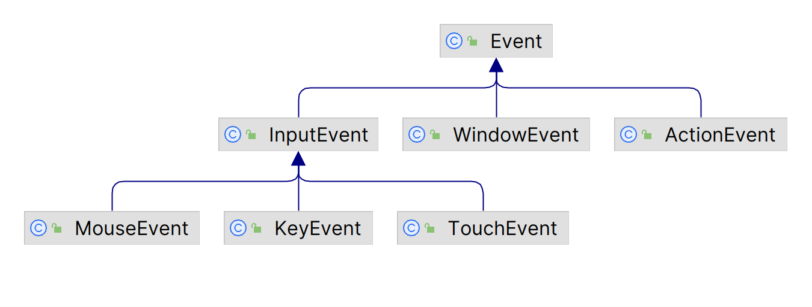

# JavaFX 事件处理概述

2023-06-25, 14:01
****
## 1. 什么是事件

在 GUI 应用程序中，事件（event）是用户与应用程序交互的操作。如点击鼠标、敲击键盘等，都是 JavaFX 事件。

JavaFX 事件由 `javafx.event.Event` 类表示。每个事件至少包含三个属性：

- 事件源（Event Source）
- 事件目标（Event Target）
- 事件类型（Event Type）

当事件发生时，一般要执行一段代码，响应事件执行的这一段代码称为事件处理器（Event Handler）或事件过滤器（Event Filter）。

调用 `EventHandler` 的 UI 元素称为**事件源**，事件沿着事件分发链传递，随着事件的传递，事件源也随之改变。

**事件目标**是事件的目的地。事件目标决定了事件处理的路径。假设点击一个 `Circle` 节点，此时，`Circle` 节点是鼠标点击事件的事件目标。

事件类型以以分层的方式定义，描述事件发生的类型。

事件的三个属性均由单独的类表示。

| 名称         | 类/接口 | 说明                                   |
| ------------ | ------- | -------------------------------------- |
| `Event`        | 类      | 表示事件，Event 的不同子类代表不同事件 |
| `EventTarget`  | 接口    | 事件目标                               |
| `EventType`    | 类      | 事件类型                               |
| `EventHandler` | 接口    | 事件处理程序                           |

## 2. Event 类图

事件类图：



`Event` 的子类表示特定的事件类型。例如：

- `InputEvent` 表示用户输入事件
- `WindowEvent` 表示窗口事件，如显示和隐藏窗口
- `ActionEvent` 表示执行某种操作的事件

`Event` 类定义了所有事件共有的属性和方法：

- `getSource()` 返回 `Object`，为事件源
- `getTarget()` 返回 `EventTarget`，为事件目标
- `getEventType()` 返回 `EventType`，为事件类型

事件沿着事件分发链传递，调用 · 表示事件已被处理，不需要继续传递；如果已调用 `Event.consume()`，`Event.isConsumed()` 返回 `true`。

`Event` 的子类根据需要定义了更多属性和方法。如 `MouseEvent` 类定义了 `getX()` 和 `getY()` 方法，返回鼠标指针相对事件源的 x 和 y 坐标。

## 3. Event Target

Event Target 是可以响应事件的 UI 元素。从技术上讲，需要响应事件的 UI 元素必须实现 `EventTarget` 接口。所以在 JavaFX 中，实现 `EventTarget` 接口使 UI 元素可以成为 Event Target。

`Window`, `Scene` 和 `Node` 类实现了 `EventTarget` 接口。这意味着所有 nodes，包括 windows 和 scenes 都可以响应事件。有些 UI 元素，如 `Tab`, `TreeItem` 和 `MenuItem` 没有继承 `Node`，它们仍然可以响应事件，因为它们实现了 `EventTarget` 接口。如果你创建了一个自定义 UI 元素，如果想让你的 UI 元素响应事件，就需要它实现这个接口。

Event Target 负责构建**事件分发器链**（chain of event dispatchers），也称为事件路径（event route）。事件分发器实现了 `EventDispatcher` 接口，`buildEventDispatchChain` 方法负责构建事件分发器链。链中的每个 dispatcher 都可以处理和 consume 事件，包括修改事件属性，用新事件替代原事件，或者将事件分发器连接起来。

假设 Stage 的 Scene 中包含一个 HBox，其中有一个 Circle，鼠标点击 Circle，Circle 成为 event target。Circle 构建事件分发器链，其路径从头到尾依次为 Stage, Scene, HBox 和 Circle。

## 4. Event Type

`EventType` 类定义事件类型。为什么需要一个单独的类来定义事件类型？`EventType` 提供了对事件更细致的划分，例如，`MouseEvent` 只告诉我们用户使用了鼠标，但是不知道使用鼠标的细节，如鼠标左键是被按下、释放还是拖动。

`EventType` 是泛型类，其 type 参数定义为：

```java
EventType<T extends Event>
```

`EventType` 也是分层组织。每个事件类型都有一个名称和一个超类型：

- `getName()` 返回事件类型名称
- `getSuperType()` 返回事件的超类型

常量 `Event.ANY`，等价于 `EventType.ROOT`，是 JavaFX 中所有事件的超类型。

下图是某些事件类中定义的一些事件类型：


