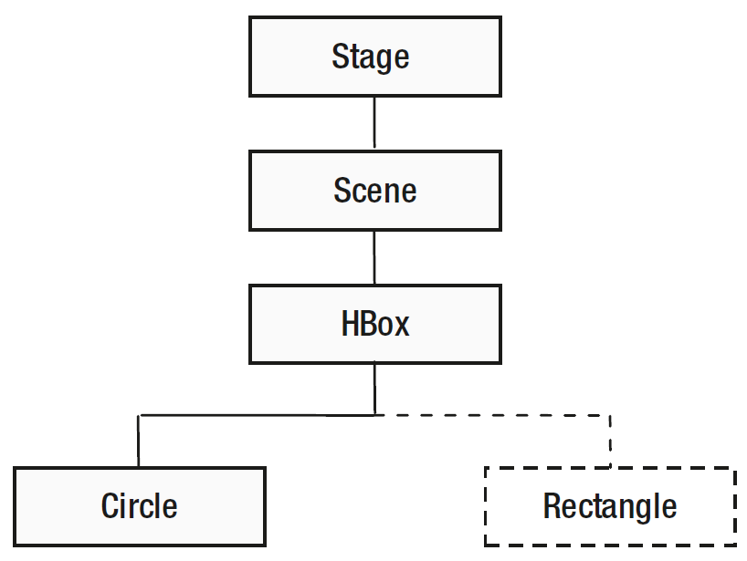
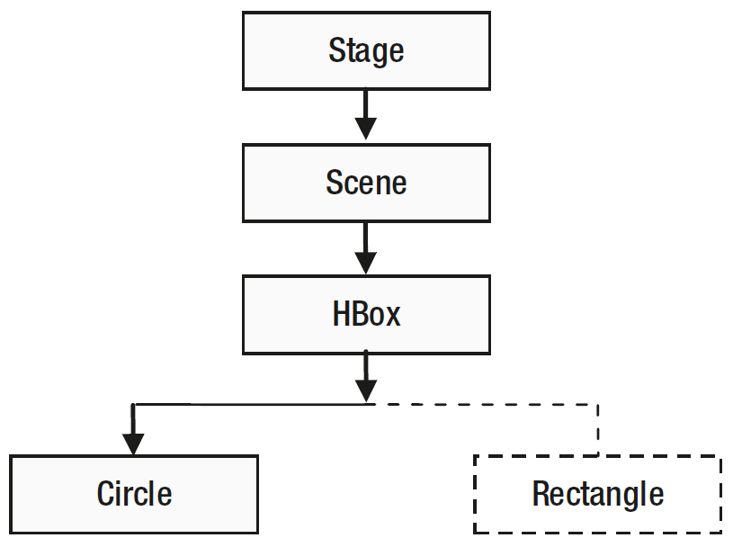
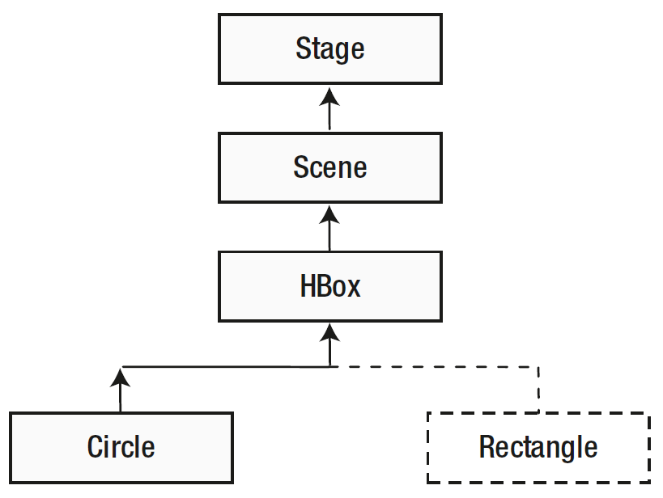

# 事件处理机制

2023-06-25, 16:19
****
## 1. 简介

事件发生时，需要执行以下几个步骤：

1. 选择事件 target
2. 构建事件路径
3. 遍历事件路径

## 2. 选择 Target

事件 target 根据事件类型选择：

- 对鼠标事件, target 是光标下的节点。光标下可能有多个节点，如将一个 circle 放在 rectangle 中，此时最上面的节点为事件 target。
- 对键盘事件, target 是持有焦点的节点。获取焦点的方式取决于节点类型。例如，`TextField` 可以通过鼠标点击或快捷键 Tab 或 Shift+Tab 获取焦点。

`Circle` 或 `Rectangle` 等 `Shape` 默认不会获得焦点。如果需要让它们接收键盘事件，可以调用 `Node.requestFocus()` 方法获取焦点。

JavaFX 支持触控设备上的触摸和手势事件。

触摸事件通过触摸触屏产生。每个触摸动作都有一个接触点，称为**触点**（touch point）。可以用多个手指接触触摸屏，产生多个触点。触点的每个状态，如按下、释放等，都会生成一个触摸事件，所以一个触摸动作可以产生多个触摸事件。例如，如果触摸事件的位置是圆内的一个点，那么圆就成为触摸事件的 target。当触点有多个节点时，target 为最上面的节点。

JavaFX 支持手势。通常，触屏上的一个手势由多个触点的多个触摸动作组成，如旋转、滚动、滑动和缩放：

- 旋转（rotating）手势通过旋转两个手指完成
- 滚动（scrolling）手势通过在触屏上拖动手指完成
- 滑动（swiping）手势通过在一个方向拖动触屏上一个或多个手指完成
- 缩放（zooming）手势通过拖动两个手指完成

手势的 target 选择取决于手势类型。对直接手势，如在触屏上执行的手势，选择手势开始处触点中心点最顶层节点作为 target；对间接手势，如在触摸板上执行的手势，选择鼠标光标最顶层节点作为 target。

## 3. 构建事件路径

事件在**事件分发链**（event diapatch chain）中通过事件分发器（event dispatcher）传递。事件分发链即**事件路径**（event route）。事件的初始路径和默认路径由事件 target 确定。默认的事件路径从 stage 开始，到事件 target 节点结束。

```ad-note
事件路径由与节点关联的事件分发器组成，为了便于解释和理解，这里直接将事件路径作为节点构成的路径进行解释。
```

下图是一个鼠标点击事件的事件路径。



鼠标点击 `Circle`，`Circle` 为事件 target，由 `Circle` 构建默认事件路径，该路径从 `Circle` 所在的 `Stage` 开始。需要注意的是，位于相同 `Scene` 中的 `Rectangle` 不在事件路径中。

事件路径包含头和尾。上例中，`Stage` 是头，`Circle` 是尾。随着事件处理的进行，事件路径可能发生变化。

## 4. 遍历事件路径

事件路径遍历包含两个阶段：

- 捕获阶段（capture）
- 冒泡阶段（bubbling）

所以要遍历两次事件路径，一次在捕获阶段，一次在冒泡阶段。可以为特定类型事件在特定节点注册事件过滤器（filter）和事件处理器（handler）：

- 事件过滤器（filter）在捕获阶段执行
- 事件处理器（handler）在冒泡阶段执行

当事件从一个节点递到另一个节点，事件源发生变化；但是事件 target 在遍历过程中保持不变。

在遍历事件路径过程中，节点可以在过滤器或处理器中消耗（consume）事件，从而完成事件处理。在 event 对象上调用 `consume()` 方法消耗事件。事件被消耗后，事件处理停止，忽略事件路径上还未遍历的节点。

### 4.1. 事件捕获阶段

在捕获阶段，从头到尾遍历事件路径。



如图所示，鼠标点击 `Circle`，捕获阶段从 `Stage` 到 `Circle` 进行遍历（箭头方向）。

当事件通过节点时，执行节点上注册的过滤器。上图中，依次执行 `Stage`, `Scene`, `HBox` 和 `Circle` 上注册的过滤器 (假设这些过滤器没有消耗事件)。

```ad-note
事件捕获阶段只执行事件**过滤器**，不执行事件**处理器**。
```

一个节点可以注册多个过滤器，当其中一个过滤器消耗掉事件，该节点余下未执行的过滤器会继续执行。例如，假设上面的 `Scene` 注册了 5 个过滤器，第一个过滤器执行并消耗掉事件，此时，`Scene` 余下的 4 个过滤器继续执行。执行完 `Scene` 的 5 个过滤器后，事件处理停止，不会传递到余下的节点。

### 4.2. 事件冒泡阶段

在冒泡阶段，从尾到头遍历事件路径。



在事件冒泡阶段，执行注册的事件处理器（handler）。

一个节点可以注册多个处理。当其中一个处理器消耗掉事件，该节点余下未执行的处理器会继续执行。例如，假设上面的 `Circle` 注册了 5 个处理器，第一个处理器执行并消耗掉事件，`Circle` 余下的 4 个处理器继续执行。执行完 `Circle` 的 5 个处理器后，事件处理停止，不会传递到余下的节点 (`HBox`, `Scene`, `Stage`)。

通常将处理器注册到 target 节点以提供对特定事件的响应。偶尔也会在父节点上注册处理器，为其所有子节点提供默认的事件响应。如果 target 决定为某个事件提供特定响应，它可以添加处理器并 消耗事件来实现，从而在终止事件向事件路径的头部传播。

例如，假设需要实现鼠标点击窗口中任何位置显示一个消息框，可以向 `Window` 注册一个处理器来显示消息框。当用户点击窗口内的一个 `Circle` 时，希望显示一条特定的消息，可以为 `Circle` 注册一个处理器，以提供特定消息并消耗事件。这样，注册在 `Window` 上的处理器提供了默认响应，注册在 `Circle` 上的处理器提供了特定响应。
