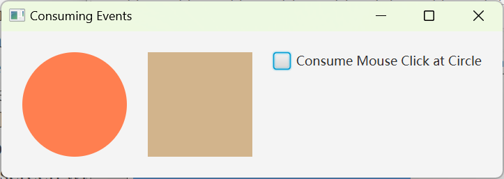

# 消耗事件

2023-06-25, 21:45
****
## 1. 简介

通过调用 `Event` 的 `consume() `方法消耗事件。一般在事件过滤器和处理器的 `handle()` 方法中调用 `consume()`。

**消耗事件**表示事件处理完成，事件不再沿着事件路径继续传播。如果事件在节点的过滤器中消耗，之间不会传递到子节点；如果事件在节点的处理器中消耗，则事件不会传递到父节点。

不管节点的哪个过滤器或处理器消耗了事件，该节点所有的过滤器或处理器都会执行。假设你为节点注册了三个处理器，第一个处理器消耗了事件，该节点余下的两个处理器仍会执行。

如果父节点不希望其子节点响应事件，则可以在父节点的过滤器中消耗事件。如果父节点为特定事件提供了默认处理器，子节点可以提供特异性的响应并消耗事件，从而抑制父节点的默认响应。

## 2. 示例

演示如何消耗事件。

```java
import javafx.application.Application;
import javafx.event.EventHandler;
import javafx.geometry.Insets;
import javafx.scene.Scene;
import javafx.scene.control.CheckBox;
import javafx.scene.input.MouseEvent;
import javafx.scene.layout.HBox;
import javafx.scene.paint.Color;
import javafx.scene.shape.Circle;
import javafx.scene.shape.Rectangle;
import javafx.stage.Stage;

import static javafx.scene.input.MouseEvent.MOUSE_CLICKED;

public class ConsumingEvents extends Application {

    private CheckBox consumeEventCbx = new CheckBox("Consume Mouse Click at Circle");

    public static void main(String[] args) {
        Application.launch(args);
    }

    @Override
    public void start(Stage stage) {
        Circle circle = new Circle(50, 50, 50);
        circle.setFill(Color.CORAL);

        Rectangle rect = new Rectangle(100, 100);
        rect.setFill(Color.TAN);

        HBox root = new HBox();
        root.setPadding(new Insets(20));
        root.setSpacing(20);
        root.getChildren().addAll(circle, rect, consumeEventCbx);

        Scene scene = new Scene(root);

        // Register mouse-clicked event handlers to all nodes,
        // except the rectangle and checkbox
        EventHandler<MouseEvent> handler = e -> handleEvent(e);
        EventHandler<MouseEvent> circleMeHandler = e -> handleEventforCircle(e);

        stage.addEventHandler(MOUSE_CLICKED, handler);
        scene.addEventHandler(MOUSE_CLICKED, handler);
        root.addEventHandler(MOUSE_CLICKED, handler);
        circle.addEventHandler(MOUSE_CLICKED, circleMeHandler);

        stage.setScene(scene);
        stage.setTitle("Consuming Events");
        stage.show();
    }

    public void handleEvent(MouseEvent e) {
        print(e);
    }

    public void handleEventforCircle(MouseEvent e) {
        print(e);
        if (consumeEventCbx.isSelected()) {
            e.consume();
        }
    }

    public void print(MouseEvent e) {
        String type = e.getEventType().getName();
        String source = e.getSource().getClass().getSimpleName();
        String target = e.getTarget().getClass().getSimpleName();

        // Get coordinates of the mouse cursor relative to the event source
        double x = e.getX();
        double y = e.getY();

        System.out.println("Type=" + type + ", Target=" + target +
                ", Source=" + source +
                ", location(" + x + ", " + y + ")");
    }
}
```



说明：

- 添加 `Circle`, `Rectangle` 和 `CheckBox` 到 `HBox`，`HBox` 作为 `Scene` 的根节点。
- 为 `Stage`, `Scene`, `HBox` 和 `Circle` 添加事件处理器，其中 `Circle` 的处理器不同。
- 当勾选复选框，`Circle` 的事件处理器会消耗事件，从而阻止事件向上传播到 `HBox`, `Scene` 和 `Stage`
- 当不勾选复选框，事件按 `Circle` -> `HBox` -> `Scene` -> `Stage` 顺序传播

```
# 不勾选复选框，点击圆
Type=MOUSE_CLICKED, Target=Circle, Source=Circle, location(50.66666666666667, 48.66666666666667)
Type=MOUSE_CLICKED, Target=Circle, Source=HBox, location(70.66666666666667, 68.66666666666667)
Type=MOUSE_CLICKED, Target=Circle, Source=Scene, location(70.66666666666667, 68.66666666666667)
Type=MOUSE_CLICKED, Target=Circle, Source=Stage, location(70.66666666666667, 68.66666666666667)

# 勾选复选项，点击圆
Type=MOUSE_CLICKED, Target=Circle, Source=Circle, location(46.0, 38.666666666666664)

# 点击 Rectangle
Type=MOUSE_CLICKED, Target=Rectangle, Source=HBox, location(192.66666666666666, 61.333333333333336)
Type=MOUSE_CLICKED, Target=Rectangle, Source=Scene, location(192.66666666666666, 61.333333333333336)
Type=MOUSE_CLICKED, Target=Rectangle, Source=Stage, location(192.66666666666666, 61.333333333333336)
```

```ad-note
点击复选框不会执行 `HBox`, `Scene` 和 `Stage` 的点击鼠标事件，而点击 `Rectangle` 会。这是因为 `CheckBox` 有一个默认的事件处理器会消耗事件，从而组织事件沿着事件路径向上传播。而 `Rectangle` 不会消耗事件。
```

在事件 target 的过滤器中消耗事件对执行其它事件过滤器没有影响，但会阻止冒泡阶段的发生，即阻止所有事件处理器的执行。在顶层节点（事件路径的头部）的事件处理器中消耗事件，对整个事件处理过程毫无影响。
