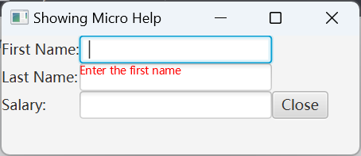

# 托管 Node

2023-06-27, 12:41
****
## 1. 简介

`Node` 类有一个名为 `managed` 的 `BooleanProperty` 类型属性，定义节点的 layout 是否由它的父节点管理，被管理的节点称为托管节点。所有节点默认为托管节点。

在 `Scene` 布局过程中，`Parent` 在计算自身尺寸时会考虑其托管子节点的 `layoutBounds`，并调整 resizable 托管子节点的尺寸，根据 layout 策略确定托管子节点位置。当托管子节点的 `layoutBounds` 发生变化，Scene graph 的相关部分也随之重新布局。

对非托管节点，由用户负责其 layout（大小和位置），即 `Parent` 不负责非托管子节点的 layout。非托管节点 `layoutBounds` 的变化也不会触发 relayout。非托管 `Parent` 节点充当 layout 的根节点。如果子节点调用 `Parent.requestLayout()`，以非托管 `Parent` 节点为根的分支重新布局。

在应用中通常不需要使用非托管节点。

如果想在容器中显示一个节点，但不想考虑其 `layoutBounds`，此时可以用非托管节点。

## 2. 示例

**示例：** 演示非托管节点的使用



使用非托管 `Text` 显示焦点节点的帮助信息。

焦点节点需要由一个名为 `microHelpText` 的属性。显示帮助信息时，整个应用的 layout 不会收到干扰，因为负责显示帮助信息的 `Text` 节点时非托管节点。

在 `focusChanged()` 方法中，将 `Text` 放在合适的位置。示例中为 scene 的 `focusOwner` 属性注册了一个 listener，从而根据焦点变化显示或隐藏 `Text` 节点。

```java
import javafx.application.Application;
import javafx.application.Platform;
import javafx.beans.value.ObservableValue;
import javafx.geometry.VPos;
import javafx.scene.Node;
import javafx.scene.Scene;
import javafx.scene.control.Button;
import javafx.scene.control.Label;
import javafx.scene.control.TextField;
import javafx.scene.layout.GridPane;
import javafx.scene.paint.Color;
import javafx.scene.text.Font;
import javafx.scene.text.Text;
import javafx.stage.Stage;

public class MicroHelpApp extends Application {

    // 显示帮助信息的 Text，非托管
    private Text helpText = new Text();

    public static void main(String[] args) {
        Application.launch(args);
    }

    @Override
    public void start(Stage stage) {
        TextField fName = new TextField();
        TextField lName = new TextField();
        TextField salary = new TextField();

        Button closeBtn = new Button("Close");
        closeBtn.setOnAction(e -> Platform.exit());

        fName.getProperties().put("microHelpText", "Enter the first name");
        lName.getProperties().put("microHelpText", "Enter the last name");
        salary.getProperties().put("microHelpText",
                "Enter a salary greater than $2000.00.");

        // 将 help text 节点设置为非托管
        helpText.setManaged(false);
        helpText.setTextOrigin(VPos.TOP);
        helpText.setFill(Color.RED);
        helpText.setFont(Font.font(null, 9));
        helpText.setMouseTransparent(true);

        // Add all nodes to a GridPane
        GridPane root = new GridPane();

        root.add(new Label("First Name:"), 1, 1);
        root.add(fName, 2, 1);
        root.add(new Label("Last Name:"), 1, 2);
        root.add(lName, 2, 2);

        root.add(new Label("Salary:"), 1, 3);
        root.add(salary, 2, 3);
        root.add(closeBtn, 3, 3);
        root.add(helpText, 4, 3);

        Scene scene = new Scene(root, 300, 100);

        // 为 focusOwnerProperty 注册 listener，从而根据焦点变化显示帮助信息
        scene.focusOwnerProperty().addListener(
                (ObservableValue<? extends Node> value, Node oldNode, Node newNode)
                        -> focusChanged(value, oldNode, newNode));
        stage.setScene(scene);
        stage.setTitle("Showing Micro Help");
        stage.show();
    }

    public void focusChanged(ObservableValue<? extends Node> value,
                             Node oldNode, Node newNode) {
        // 焦点发生变化
        String microHelpText = (String) newNode.getProperties().get("microHelpText");

        if (microHelpText != null && microHelpText.trim().length() > 0) {
            helpText.setText(microHelpText);
            helpText.setVisible(true);

            // Position the help text node
            double x = newNode.getLayoutX() +
                    newNode.getLayoutBounds().getMinX() -
                    helpText.getLayoutBounds().getMinX();
            double y = newNode.getLayoutY() +
                    newNode.getLayoutBounds().getMinY() +
                    newNode.getLayoutBounds().getHeight() -
                    helpText.getLayoutBounds().getMinX();

            helpText.setLayoutX(x);
            helpText.setLayoutY(y);
            helpText.setWrappingWidth(newNode.getLayoutBounds().getWidth());
        } else {
            helpText.setVisible(false);
        }
    }
}
```

## 3. 可见性

`Node` 的 `visibleProperty()` 用于设置节点的可见性。假设有一个包含几个按钮的 `HBox`，当其中一个按钮隐藏，希望所有按钮从右到左滑动，把隐藏按钮的位置填上。

将 `managed` 属性和 `visible` 属性绑定，可实现该功能。

**示例：** 在 `HBox` 中实现向左滑动的功能。


显示 4 个按钮，点击第一个按钮使第三个按钮 "B2" 显示或隐藏。B2 按钮的 `managed` 和 `visible` 属性绑定。

- 点击第一个按钮 "Make Invisible"，B2 隐藏，所有按钮向左滑动
- 点击第一个按钮 "Make Visible"，B2 显示，所有按钮向右滑动

```java
import javafx.application.Application;
import javafx.beans.binding.When;
import javafx.scene.Scene;
import javafx.scene.control.Button;
import javafx.scene.layout.HBox;
import javafx.stage.Stage;

public class SlidingLeftNodeTest extends Application {

    public static void main(String[] args) {
        Application.launch(args);
    }

    @Override
    public void start(Stage stage) {
        Button b1 = new Button("B1");
        Button b2 = new Button("B2");
        Button b3 = new Button("B3");
        Button visibleBtn = new Button("Make Invisible");

        // 为第一个按钮添加事件处理器，改变 B2 的 visible 属性
        visibleBtn.setOnAction(e -> b2.setVisible(!b2.isVisible()));

        // 按钮的 text 属性与 B2 的 visible 属性绑定
        visibleBtn.textProperty().bind(new When(b2.visibleProperty())
                .then("Make Invisible")
                .otherwise("Make Visible"));

        // B2 的 managed 属性与 visible 属性绑定
        b2.managedProperty().bind(b2.visibleProperty());

        HBox root = new HBox();
        root.getChildren().addAll(visibleBtn, b1, b2, b3);

        Scene scene = new Scene(root);
        stage.setScene(scene);
        stage.setTitle("Sliding to the Left");
        stage.show();
    }
}
```

