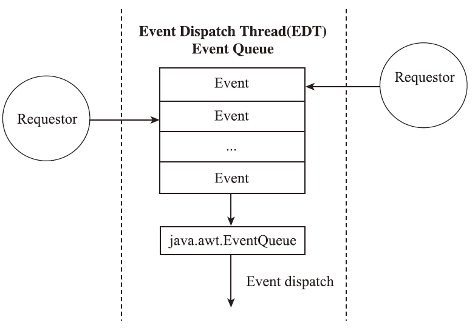
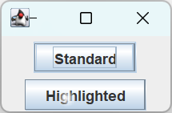
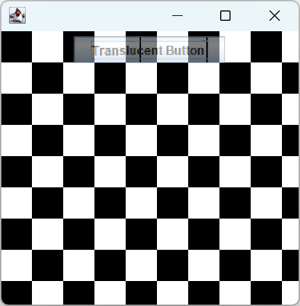

# Swing 渲染原理

- [Swing 渲染原理](#swing-渲染原理)
  - [事件](#事件)
  - [Swing 绘制](#swing-绘制)
    - [异步重绘请求](#异步重绘请求)
    - [同步的绘制请求](#同步的绘制请求)
  - [Swing 渲染](#swing-渲染)
    - [paintComponent](#paintcomponent)
    - [paint](#paint)
    - [setOpaque](#setopaque)
  - [双缓冲](#双缓冲)
  - [线程](#线程)

2021-11-13, 09:15
***
## 事件

Swing 事件都放置在一个队列中，`java.awt.EventQueue` 负责从这个队列中取出并派发事件。`EventQueue` 的派发由一个单独的线程管理，这个线程称为事件派发线程（Event Dispatch Thread, EDT）。下图演示放入和处理事件的机制：



在 Swing 中，**所有与 GUI 相关的工作都必须在 EDT 中发生**。应用程序需要做的涉及修改 GUI 的任何工作也必须在 EDT 中处理。

## Swing 绘制

Swing 中的绘制是应用程序更新显示的过程。

- 如果有自定义的绘制行为，该过程可以调用自定义代码；
- 如果没有自定义的绘制行为，就只调用重新绘制标准组件的 Swing 内部代码。

这个过程由发布在事件队列中的绘制请求组成，绘制请求导致调用 EDT 中受影响 Swing 组件的 `paint()` 和 `paintComponent()` 方法。

发起绘制请求的方法有两种：

- Swing 或 AWT 库自身发起绘制请求；
- 应用程序代码发起绘制请求。

Swing 或 AWT 库自身发起重新绘制请求以响应本地系统或 GUI 组件中的事件。例如，当一个应用程序窗口第一次显示在屏幕上时，或者当它改变大小或暴露在屏幕上时，AWT 收到一个本地的暴露事件并发起一个 Java 事件使这个窗口重绘自己。同样，当一个组件的状态改变时，如按住一个按钮，Swing 发起一个绘制请求以确保按钮显示为按住的状态。

应该程序也可以直接对 Swing 发起一个绘制请求。组件中有很多用于发起绘制的方法。这些方法分为两类：异步请求和同步请求

### 异步重绘请求

异步重绘请求是告诉 Swing 需要更新的内容，让 Swing 处理这些请求的细节。

所有的异步请求都是 `repaint()` 方法的变体。它们基本分为两种类型：

- 请求整个组件更新；
- 指定需要更新的区域。

1. `Component.repaint()`

这是最容易处理的方法：告诉 Swing 整个组件都要更新。

如果这个组件是一个容器，后续的 `paint()` 方法调用会导致每个子组件更新自身。对不经常发生重绘或者 GUI 不是很复杂的情况，这样做还好。但是在性能敏感的情况下，要避免绘制不需要绘制的组件，可以使用下面的方法。

2. `Component.repaint(int x, int y, int width, int height)`

该方法要求 Swing 重新绘制组件中指定的矩形。使用该方法可以减少绘制工作量，提高性能。

### 同步的绘制请求

要谨慎使用同步绘制方法。

Swing 组件的绘制必须在 EDT 中进行。所以调用同步的绘制方法，代码必须在正确的线程中执行。例如处理一个输入事件，需要作为那个请求的一部分来重新沪指。此时不用把请求放到 `EventQueue` 中，可以立刻处理这个绘制并继续工作。`paintImmediately()` 方法适用于该情况：

```java
JComponent.paintImmediately(int x, int y, int w, int h)
JComponent.paintImmediately(Rectangle r)
```

这两个方法是相同的，都执行需要更新的区域。要强制一个组件内容同步绘制，`paintImmediately()` 是唯一需要调用的方法。该方法告诉这个组件指定区域必须更新，Swing 内部调用所有适当组件的 `paint()` 方法进行更新。

调用 `paintImmediately()` 方法的缺点：

- 必须在 EDT 中调用；
- 立刻执行 paint 调用，所有没有合并绘制的请求。

```java
Component.paint(Graphics)
```

Swing 程序中通常不用显式调动 `paint()`。在需要定制组件时会用到。

## Swing 渲染

Swing 渲染以 EDT 为中心，简单易懂。首先，将绘制请求放到事件队列，通过 EDT，事件派发到 Swing RepaintManager，该对象调用需要重绘组件的 `paint()` 方法，该方法导致一个组件先绘制它自己的内容，然后绘制它的边界，最后绘制它包含的组件。这是一个由后到前的绘制方法，从 `JFrame` 开始，直到最前面的组件。如下所示：


整个组件的层次，从 `JFrame` 到最低的按钮，都得到渲染。应用程序需要关注下面三个方法：

1. `JComponent.paintComponent(Graphics)`

需要定制组件的程序需要覆盖该方法。

2. `Component.paint(Graphics)`

在需要组件和它的子组件的图形状态时，需要覆盖该方法。

3. `JComponent.setOpaque(Boolean)`

设置透明度，除 `JLabel` 外，所有 Swing 组件默认不透明。

### paintComponent

`paintComponent()` 是定制 Swing 组件最重要的方法。

**示例：** 定制一个包含灰色椭圆的组件

```java
import javax.swing.*;
import java.awt.*;

public class OvalComponent extends JComponent
{
    @Override
    protected void paintComponent(Graphics g) {
        g.setColor(getBackground());
        g.fillRect(0, 0, getWidth(), getHeight());
        g.setColor(Color.GRAY);
        g.fillOval(0, 0, getWidth(), getHeight());
    }

    private static void createAndShowGUI() {
        JFrame f = new JFrame("Oval");
        f.setDefaultCloseOperation(JFrame.EXIT_ON_CLOSE);
        f.setSize(200, 200);
        f.add(new OvalComponent());
        f.setVisible(true);
    }

    public static void main(String[] args) {
        Runnable doCreateAndShowGUI = OvalComponent::createAndShowGUI;
        SwingUtilities.invokeLater(doCreateAndShowGUI);
    }
}
```


首先用组件当前背景色填充整个区域，然后将颜色设置为灰色，填充椭圆。

这里没有调用 `super.paintComponent`，因为上面完全绘制了组件的所有内容。

**示例：** 修改标准 GUI 组件的渲染

```java
import javax.swing.*;
import java.awt.*;
import java.awt.geom.Point2D;
import java.awt.image.BufferedImage;

public class HighlightedButton extends JButton
{
    static final int HIGHLIGHT_SIZE = 18;
    BufferedImage highlight = new BufferedImage(HIGHLIGHT_SIZE, HIGHLIGHT_SIZE, BufferedImage.TYPE_INT_ARGB);

    public HighlightedButton(String label) {
        super(label);

        // Get the Graphics for the image
        Graphics2D g2d = highlight.createGraphics();

        // Erase the image with a transparent background
        g2d.setComposite(AlphaComposite.Clear);
        g2d.fillRect(0, 0, HIGHLIGHT_SIZE, HIGHLIGHT_SIZE);
        g2d.setComposite(AlphaComposite.SrcOver);

        // Draw the highlight
        Point2D center = new Point2D.Float((float) HIGHLIGHT_SIZE / 2.0f,
                (float) HIGHLIGHT_SIZE / 2.0f);
        float radius = (float) HIGHLIGHT_SIZE / 2.0f;
        float[] dist = {0.0f, .85f};
        Color[] colors = {Color.white, new Color(255, 255, 255, 0)};
        RadialGradientPaint paint = new RadialGradientPaint(center, radius, dist, colors);
        g2d.setPaint(paint);
        g2d.fillOval(0, 0, HIGHLIGHT_SIZE, HIGHLIGHT_SIZE);
        g2d.dispose();
    }

    @Override
    protected void paintComponent(Graphics g) {
        super.paintComponent(g);
        g.drawImage(highlight, getWidth() / 4, getHeight() / 4, null);
    }

    private static void createAndShowGUI() {
        JFrame f = new JFrame();
        f.getContentPane().setLayout(new FlowLayout());
        f.setDefaultCloseOperation(JFrame.EXIT_ON_CLOSE);
        f.setSize(100, 100);
        f.add(new JButton("Standard"));
        f.add(new HighlightedButton("Highlighted"));
        f.setVisible(true);
    }

    public static void main(String[] args) {
        SwingUtilities.invokeLater(HighlightedButton::createAndShowGUI);
    }
}
```



这里有两个 JButton，标签为 "Standard" 的按钮完全由 Swing 绘制；标签为 "Highlighted" 的按钮由 Swing 和 `paintComponent()` 共同渲染。第二个按钮显示了一个高亮效果，这个效果通过绘制一个放射状渐变的图像获得；这个渐变从透明变化到中间的不透明的白色。

这里扩展标准 JButton 类，然后复写 paintComponent() 方法以定制渲染。此时通过调用 `super.paintComponent(g)` 用 Swing 绘制主要的按钮内容，然后单独调用 `drawImage()` 添加定制效果，这个效果在上面绘制这个加亮图像。

实际上，这个例子中唯一有趣的部分是如何创建加亮图像。这里使用 `RadialGradientPaint` 和一个透明的 `BufferedImage` 可以做到这一点。

### paint

在早期 AWT 程序中，复写 paint() 等同 Swing 中复写 paintComponent()。然而，在 Swing 中，JComponent (所有 Swing 组件的超类)中的 paint() 方法处理渲染组件通常需要的所有东西，包括绘制内容、边界和子组件。Swing 的绘制模式还处理双缓冲。因此，在 Swing 程序中不推荐复写 `paint()`。

少数情况需要复写 `paint()`，如半透明组件。如果要使一个 Swing 组件（包括它的子组件和边界）完全半透明，那就必须修改传入 `paint()` 方法的 `Graphics` 对象的 `Composite` 属性。当然，也可以修改传入 `paintComponent()` 的 Graphics 对象，但是那样只会修改组件内容的渲染。JComponent 为每个 paintComponent 调用创建一个新的 Graphics 对象，因此，修改那个 Graphics 对象的状态只会影响单个组件的内容。你应该做的是修改用来渲染内容、边界和子组件的 Graphics 对象。所以要修改传入 `paint()` 方法的 Graphics 对象。

```java
import javax.swing.*;
import java.awt.*;
import java.awt.image.BufferedImage;

public class TranslucentButton extends JButton
{
    BufferedImage buttonImage = null; // 用来保存按钮的渲染结果的图像

    public TranslucentButton(String text) {
        super(text);
        setOpaque(false); // 说明是透明的
    }

    // 覆盖 paint()，使其组件的所有内容（包括边界和子组件）变得半透明
    @Override
    public void paint(Graphics g) {
        // Create an image for the button graphics if necessary
        if (buttonImage == null || buttonImage.getWidth() != getWidth()
                || buttonImage.getHeight() != getHeight()) {
            buttonImage = getGraphicsConfiguration().createCompatibleImage(getWidth(), getHeight());
        }
        Graphics gButton = buttonImage.getGraphics();
        gButton.setClip(g.getClip());

        // 将按钮渲染到创建的图像中
        super.paint(gButton);

        // 在目标 graphics 上添加一个半透明 Composite
        Graphics2D g2d = (Graphics2D) g;
        AlphaComposite newComposite = AlphaComposite.getInstance(AlphaComposite.SRC_OVER, .5f);
        g2d.setComposite(newComposite);

        // 将图像复制到半透明 Composite 的目标 graphic，从而把按钮半透明地渲染到 Swing 窗口
        g2d.drawImage(buttonImage, 0, 0, null);
    }

    private static void createAndShowGUI() {
        JFrame f = new JFrame();
        f.setDefaultCloseOperation(JFrame.EXIT_ON_CLOSE);
        f.setSize(300, 300);
        JPanel checkerboard = new Checkerboard();
        checkerboard.add(new TranslucentButton("Translucent Button"));
        f.add(checkerboard);
        f.setVisible(true);
    }

    public static void main(String[] args) {
        Runnable doCreateAndShowGUI = () -> createAndShowGUI();
        SwingUtilities.invokeLater(doCreateAndShowGUI);
    }

    private static class Checkerboard extends JPanel
    {
        private static final int DIVISIONS = 10;
        static final int CHECKER_SIZE = 60;

        public void paintComponent(Graphics g) {
            g.setColor(Color.white);
            g.fillRect(0, 0, getWidth(), getHeight());
            g.setColor(Color.BLACK);
            for (int stripeX = 0; stripeX < getWidth(); stripeX += CHECKER_SIZE) {
                for (int y = 0, row = 0; y < getHeight(); y += CHECKER_SIZE / 2, ++row) {
                    int x = (row % 2 == 0) ? stripeX : (stripeX + CHECKER_SIZE / 2);
                    g.fillRect(x, y, CHECKER_SIZE / 2, CHECKER_SIZE / 2);
                }
            }
        }
    }
}
```



TranslucentButton 展示了图像的一个用法。也可以直接设置 Graphics 的状态并让超类绘制到那个 Graphics 对象中。然而，这个比较直接的方法在许多情况下行不同。例如，如果超类的 paint() 方法改变了 Graphics 对象的状态并压制你的设置，那么就不能得到预期结果。

### setOpaque

Swing 中的不透明和 Java2D 的不透明不一样。

在 Java2D 中，不透明度描述了要绘制的像素颜色和已经在那里的像素值的混合程度。所以，一个半透明的原始图像应该使用一半现有的像素颜色值和一半原始像素的颜色值，来确定绘制原始图像所接触到的每个像素的新像素颜色。


## 双缓冲

双缓冲使用一个屏幕之外的，称为后台缓冲的图像作为它的渲染操作的目的地。在适当的时候，把这个后台缓冲复制到屏幕。这个更新屏幕的过程通常比来自所有渲染操作单独的更新更平滑，因为它同时发生。下图是单缓冲和双缓冲的差别：


双缓冲的优势有两点：

- 对游戏或其它动态的、图形密集的应用程序，双缓冲使其更新更平滑；
- Swing 程序的分层绘制的方式，双缓冲可以对用户隐藏中间层渲染，只用这个窗口的最终内容更新屏幕。

## 线程

每个 Swing 组件都有两个可以**在任何线程调用**的方法：

- repaint()：刷心显示
- revalidate()：强制一个组件展示它的子组件

Swing 的 API 中广泛使用 `repaint()` 使组件的属性和屏幕同步。
