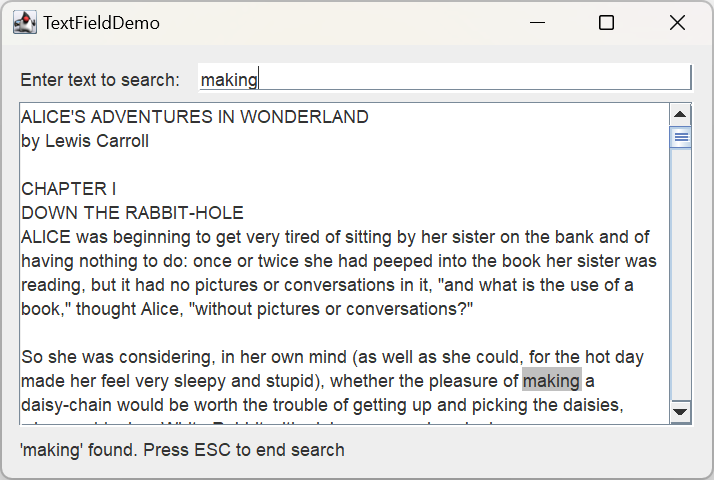

# JTextField

- [JTextField](#jtextfield)
  - [简介](#简介)
  - [示例](#示例)
  - [示例 2](#示例-2)
  - [JTextField API](#jtextfield-api)
    - [设置或获取字段内容](#设置或获取字段内容)
    - [调整外观](#调整外观)

2023-12-25, 15:30
***

## 简介

text-field 是一个基本文本组件，用于输入少量文本。当用户指示输入完成（通常按 Enter 键），`TextField` 触发 action-event。如果需要多行文本，请使用 text-area。

Swing 提供了多种类型的 text-field：

|类型|说明|
|---|---|
|`JTextField`|基本 text-field|
|`JFormattedTextField`|`JTextField` 子类，可以指定合法输入|
|`JPasswordField`|`JTextField` 子类，不显示用户输入的字符|
|`JComboBox`|可以编辑，并提供选项|
|`JSpinner`|将 `JFormattedTextField` 与两个按钮组合，使用户可以选择上一个或下一个|

## 示例

显示一个基本 text-field 和一个 text-area。text-field 可编辑，text-area 不可编辑。当用户在 text-field 中按回车，程序将 text-field 中的文本复制到 text-area，然后选中 text-field 中所有文本。


创建 text-field：

```java
textField = new JTextField(20);
```

`JTextField` 构造函数的参数 int 表示 text-field 的 column 数。该数值与 text-field 的字体一起使用，计算 text-field 的 preferredWidth。它不限制用户输入的字符串。

> 建议为每个 text-field 设置 column 数。否则每当更改文本，text-field 的首选大小都会改变，从而影响布局。

下一行将 `TextDemo` 注册为 actionListener：

```java
textField.addActionListener(this);
```

`actionPerformed` 方法处理来自 text-field 的 actionEvents：

```java
private final static String newline = "\n";
...
public void actionPerformed(ActionEvent evt) {
    String text = textField.getText();
    textArea.append(text + newline);
    textField.selectAll();
}
```

这里使用 `JTextField` 的 `getText` 方法获取 text-field 当前包含的文本，该文本不包含触发 actionEvent 的 Enter 键。

完整代码：

```java
public class TextDemo extends JPanel implements ActionListener {

    protected JTextField textField;
    protected JTextArea textArea;
    private final static String newline = "\n";

    public TextDemo() {
        super(new GridBagLayout());

        // 创建并设置 text-field
        textField = new JTextField(20);
        textField.addActionListener(this);

        textArea = new JTextArea(5, 20);
        textArea.setEditable(false);
        JScrollPane scrollPane = new JScrollPane(textArea);

        GridBagConstraints c = new GridBagConstraints();
        c.gridwidth = GridBagConstraints.REMAINDER;

        c.fill = GridBagConstraints.HORIZONTAL;
        add(textField, c);

        c.fill = GridBagConstraints.BOTH;
        c.weightx = 1.0;
        c.weighty = 1.0;
        add(scrollPane, c);
    }

    public void actionPerformed(ActionEvent evt) {
        String text = textField.getText();
        textArea.append(text + newline);
        textField.selectAll();

        // 确保新添加的文本可见
        textArea.setCaretPosition(textArea.getDocument().getLength());
    }

    private static void createAndShowGUI() {
        JFrame frame = new JFrame("TextDemo");
        frame.setDefaultCloseOperation(JFrame.EXIT_ON_CLOSE);

        frame.add(new TextDemo());

        frame.pack();
        frame.setVisible(true);
    }

    public static void main(String[] args) {
        EventQueue.invokeLater(TextDemo::createAndShowGUI);
    }
}
```

`JTextField` 继承 `JTextComponent` 类，非常灵活，可以根据需要进行定制。例如，可以添加文档 listener 或文档 filter，在文本更改时得到通知；在 filter 中可以相应地修改文本字段。

## 示例 2

这个示例依然包含一个 text-field 和一个 text-area。

当你在 text-field 中键入文本，程序会在 text-area 中搜索该文本。如果找到，就突出显示。如果未找到，以 text-field 背景变为粉红色。text-area 下方有一个状态栏，显示消息。



为了高亮文本，本例使用了 `Highlighter` 和 `HighlightPainter`。下面的代码创建并设置 text-area 的 highlighter 和 painter：

```java
final Highlighter hilit;
final Highlighter.HighlightPainter painter;
...
hilit = new DefaultHighlighter();
painter = new DefaultHighlighter.DefaultHighlightPainter(HILIT_COLOR);
textArea.setHighlighter(hilit);
```

下面的代码为 text-field 添加 documentListener：

```java
entry.getDocument().addDocumentListener(this);
```

`DocumentListener` 的 insertUpdate 和 removeUpdate 方法调用 search 方法，search 不仅在 text-area 执行检索，还处理高亮显示。下面的代码高亮找到的文本，并将插入符号设置到匹配项的末尾，并设置 textf-field 的背景，在状态栏显示消息：

```java
hilit.addHighlight(index, end, painter);
textArea.setCaretPosition(end);
entry.setBackground(entryBg);
message("'" + s + "' found. Press ESC to end search");
```

状态栏是一个 `JLabel` 对象。下面的代码显示如何实现 `message` 方法：

```java
private JLabel status;
...
void message(String msg) {
    status.setText(msg);
}
```

如果 text-area 中没有匹配项，下面的代码将 text-field 的背景更改为粉色，并显示消息：

```java
entry.setBackground(ERROR_COLOR);
message("'" + s + "' not found. Press ESC to start a new search");
```

`CancelAction` 类用于处理 Escape key 操作：

```java
class CancelAction extends AbstractAction {

    public void actionPerformed(ActionEvent ev) {
        hilit.removeAllHighlights();
        entry.setText("");
        entry.setBackground(entryBg);
    }
}
```

完整代码：

```java
public class TextFieldDemo extends JFrame implements DocumentListener {

    private JTextField entry;
    private JLabel jLabel1;
    private JScrollPane jScrollPane1;
    private JLabel status;
    private JTextArea textArea;

    final static Color HILIT_COLOR = Color.LIGHT_GRAY;
    final static Color ERROR_COLOR = Color.PINK;
    final static String CANCEL_ACTION = "cancel-search";

    final Color entryBg;
    final Highlighter hilit;
    final Highlighter.HighlightPainter painter;

    public TextFieldDemo() {
        initComponents();

        InputStream in = getClass().getResourceAsStream("content.txt");
        try {
            textArea.read(new InputStreamReader(in), null);
        } catch (IOException e) {
            e.printStackTrace();
        }

        hilit = new DefaultHighlighter();
        painter = new DefaultHighlighter.DefaultHighlightPainter(HILIT_COLOR);
        textArea.setHighlighter(hilit);

        entryBg = entry.getBackground();
        entry.getDocument().addDocumentListener(this);

        InputMap im = entry.getInputMap(JComponent.WHEN_IN_FOCUSED_WINDOW);
        ActionMap am = entry.getActionMap();
        im.put(KeyStroke.getKeyStroke("ESCAPE"), CANCEL_ACTION);
        am.put(CANCEL_ACTION, new CancelAction());
    }

    /**
     * This method is called from within the constructor to
     * initialize the form.
     */
    private void initComponents() {
        entry = new JTextField();
        textArea = new JTextArea();
        status = new JLabel();
        jLabel1 = new JLabel();

        setDefaultCloseOperation(WindowConstants.EXIT_ON_CLOSE);
        setTitle("TextFieldDemo");

        textArea.setColumns(20);
        textArea.setLineWrap(true);
        textArea.setRows(5);
        textArea.setWrapStyleWord(true);
        textArea.setEditable(false);
        jScrollPane1 = new JScrollPane(textArea);

        jLabel1.setText("Enter text to search:");

        GroupLayout layout = new GroupLayout(getContentPane());
        getContentPane().setLayout(layout);

        //Create a parallel group for the horizontal axis
        ParallelGroup hGroup = layout.createParallelGroup(GroupLayout.Alignment.LEADING);

        //Create a sequential and a parallel groups
        SequentialGroup h1 = layout.createSequentialGroup();
        ParallelGroup h2 = layout.createParallelGroup(GroupLayout.Alignment.TRAILING);

        //Add a container gap to the sequential group h1
        h1.addContainerGap();

        //Add a scroll pane and a label to the parallel group h2
        h2.addComponent(jScrollPane1, GroupLayout.Alignment.LEADING, GroupLayout.DEFAULT_SIZE, 450, Short.MAX_VALUE);
        h2.addComponent(status, GroupLayout.Alignment.LEADING, GroupLayout.DEFAULT_SIZE, 450, Short.MAX_VALUE);

        //Create a sequential group h3
        SequentialGroup h3 = layout.createSequentialGroup();
        h3.addComponent(jLabel1);
        h3.addPreferredGap(LayoutStyle.ComponentPlacement.RELATED);
        h3.addComponent(entry, GroupLayout.DEFAULT_SIZE, 321, Short.MAX_VALUE);

        //Add the group h3 to the group h2
        h2.addGroup(h3);
        //Add the group h2 to the group h1
        h1.addGroup(h2);

        h1.addContainerGap();

        //Add the group h1 to the hGroup
        hGroup.addGroup(GroupLayout.Alignment.TRAILING, h1);
        //Create the horizontal group
        layout.setHorizontalGroup(hGroup);


        //Create a parallel group for the vertical axis
        ParallelGroup vGroup = layout.createParallelGroup(GroupLayout.Alignment.LEADING);
        //Create a sequential group v1
        SequentialGroup v1 = layout.createSequentialGroup();
        //Add a container gap to the sequential group v1
        v1.addContainerGap();
        //Create a parallel group v2
        ParallelGroup v2 = layout.createParallelGroup(GroupLayout.Alignment.BASELINE);
        v2.addComponent(jLabel1);
        v2.addComponent(entry, GroupLayout.PREFERRED_SIZE, GroupLayout.DEFAULT_SIZE, GroupLayout.PREFERRED_SIZE);
        //Add the group v2 tp the group v1
        v1.addGroup(v2);
        v1.addPreferredGap(javax.swing.LayoutStyle.ComponentPlacement.RELATED);
        v1.addComponent(jScrollPane1, GroupLayout.DEFAULT_SIZE, 233, Short.MAX_VALUE);
        v1.addPreferredGap(javax.swing.LayoutStyle.ComponentPlacement.RELATED);
        v1.addComponent(status);
        v1.addContainerGap();

        //Add the group v1 to the group vGroup
        vGroup.addGroup(v1);
        //Create the vertical group
        layout.setVerticalGroup(vGroup);
        pack();
    }

    public void search() {
        hilit.removeAllHighlights();

        String s = entry.getText();
        if (s.length() <= 0) {
            message("Nothing to search");
            return;
        }

        String content = textArea.getText();
        int index = content.indexOf(s, 0);
        if (index >= 0) {   // match found
            try {
                int end = index + s.length();
                hilit.addHighlight(index, end, painter);
                textArea.setCaretPosition(end);
                entry.setBackground(entryBg);
                message("'" + s + "' found. Press ESC to end search");
            } catch (BadLocationException e) {
                e.printStackTrace();
            }
        } else {
            entry.setBackground(ERROR_COLOR);
            message("'" + s + "' not found. Press ESC to start a new search");
        }
    }

    void message(String msg) {
        status.setText(msg);
    }

    // DocumentListener 方法
    public void insertUpdate(DocumentEvent ev) {
        search();
    }

    public void removeUpdate(DocumentEvent ev) {
        search();
    }

    public void changedUpdate(DocumentEvent ev) {
    }

    class CancelAction extends AbstractAction {

        public void actionPerformed(ActionEvent ev) {
            hilit.removeAllHighlights();
            entry.setText("");
            entry.setBackground(entryBg);
        }
    }

    public static void main(String args[]) {
        SwingUtilities.invokeLater(new Runnable() {
            public void run() {
                //Turn off metal's use of bold fonts
                UIManager.put("swing.boldMetal", Boolean.FALSE);
                new TextFieldDemo().setVisible(true);
            }
        });
    }

}
```

## JTextField API

下面仅列出 `JTextField` 常用 API，其它方法定义在 `JTextComponent` 类中。

还可以调用 `JTextField` 从其它父类继承的方法，如 `setPreferredSize`, `setForeground`, `setBackground`, `setFont` 等，可参考 [JComponent 类](JComponent.md#jcomponent-api)。

### 设置或获取字段内容

- 创建 `JTextField`，`int` 参数指定 column 宽度。String 参数指定初始文本

```java
JTextField()
JTextField(String)
JTextField(String, int)
JTextField(int)
```

- 设置或获取 text-field 显示的文本

```java
void setText(String)
String getText()
```

### 调整外观

- 设置或提示用户是否可编辑

```java
void setEditable(boolean)
boolean isEditable()
```

