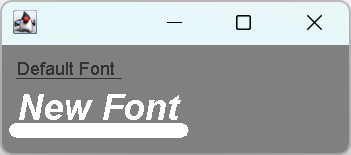

# Graphics2D

- [Graphics2D](#graphics2d)
  - [简介](#简介)
  - [获取 Graphics 对象](#获取-graphics-对象)
  - [Graphics2D 方法](#graphics2d-方法)
  - [Graphics2D 属性](#graphics2d-属性)
    - [渲染提示](#渲染提示)

***

## 简介

`paintComponent()` 的唯一参数为 `Graphics` 类型，该类包含许多绘制 2D 图形以及设置绘图参数的方法。

`Graphics2D` 类扩展 `Graphics`，它提供更多图形绘制、坐标轴转换、颜色管理、文本布局等更为精细的控制。Swing 几乎始终使用 `Graphics2D`。

`Graphics2D` 对 `Graphics` 的扩展主要体现在：

- 对渲染质量的控制：消除锯齿以平滑绘制对象的边缘；
- 裁剪、合成和透明度：它们允许使用任意形状来限定绘制操作的边界。它们还提供对图形进行分层以及控制透明度等。
- 控制和填充形状：这种功能提供了一个Stroke代理和一个Paint代理，前者用来绘制形状轮廓的笔，后者允许用纯色、渐变色和图案来填充形状。

`Graphics` 在传递给 `paintComponent()` 方法前已初始化，然后依次传递给 `paintBorder()` 和 `paintChildren()`。这样重用 `Graphics` 可提高性能，不过当参数设置不当，会导致问题。所以，要么恢复 `Graphics` 设置，要么创建 `Graphics` 的副本使用，使用 `Graphics` 的 `create()` 方法创建副本，记得最后用 `dispose()` 方法释放。

实际上，只使用 font, color, rendering-hints 属性不需要创建 `Graphics` 副本。其它属性，特别是剪辑(clip)、合成操作(composite)和转换(transformations)，则必须创建 `Graphics` 副本，使用后 `dispose` 掉。

## 获取 Graphics 对象

在 Swing 程序中，渲染的典型应用发生在类似于 `paintComponent()` 的方法中，这些方法中 Graphics 对象作为参数传入，即不需要创建一个 `Graphics` 对象。

- 复制 `Graphics` 对象

使用 `Graphics.create()` 创建 Graphics 副本，可以避免修改原 Graphics，不容易出错。

```java
protected void paintComponent(Graphics g) {
    // 创建副本
    Graphics gTemp = g.create();
    
    // 设置 gTemp 状态
    gTemp.translate(x, y);
    
    // 使用 gTemp 渲染组件
    gTemp.dispose();    
}
```

- 渲染到图像

很多时候需要把图形（graphics）渲染到图像（image）。Image 对象没有可复写的 paintComponent() 方法，所以 Swing 不会自动创建一个 Graphics 对象。此时可以向 Image 要求一个：

```java
Image img = createImage(w, h);
Graphics g = img.getGraphics();
```

`getGraphics()` 返回一个直接渲染这个图像的 Graphics 对象。

!!! note
    有些 Image 是只读的，例如，通过 Toolkit.getImage() 装载图像数据创建的 Image，这些 Image 不能渲染。所以建议使用 BufferedImage。

从 BufferedImage 获取 Graphics2D:

```java
BufferedImage bImg;
Graphics2D g2d = gImg.createGraphics();
```


## Graphics2D 方法

|方法|功能|
|---|---|
|`draw`|使用 `stroke` 和 `paint` 属性绘制基本图形|
|`fill`|使用 `paint` 属性以颜色或 pattern 填充图形|
|`drawString`|渲染文本，`font` 将文本转换为 glyph，然后用 color 或 pattern 填充|
|`drawImage`|渲染图像| 
|`drawOval`|渲染椭圆|
|`fillRect`|渲染矩形|

`Graphics2D` 的方法可以分为两类：

1. 画图
2. 影响画图的方法

影响画图的方法，指设置 `Graphics2D` 的状态属性，包括：

- 笔画宽度
- 笔画连接方式
- 剪辑路径，限制渲染区域
- 渲染时对象的平移、旋转、缩放和剪切
- 填充的颜色和图案
- 如何组合多个图形

## Graphics2D 属性

Graphics 属性，也称为图形状态。

|属性|说明|
|---|---|
|前景色（foreground color）|绘制基本元素的颜色|
|背景色（background color）|当抹去某一区域时使用的颜色|
|字体（font）|在文本基本元素中使用的字体|
|笔画（stroke）|用在基于线的基本元素，指定绘制线条时的线宽、虚线模式、末端连接方式和末端样式|
|填充（fill）|图形内部填充方式，包括纯色、渐变色和图案等填充方式|
|渲染提示（rendering hint）|Java 2D 用来确定渲染各种基本元素的**品质和性能**的信息|
|剪辑（clip）|通过 `Shape` 对象指定图画所在区域|
|合成（Composite）|把图像基本元素的颜色数据和目标中的颜色数据合成起来的方法|
|着色（Paint）|类似颜色（color），Paint 确定如何给像素着色（通过绘制基本元素）|
|转换（transform）|基本元素的大小、位置和方向|

- 设置和获取前景颜色

```java
public void setColor(Color c)
public Color getColor()
```

`setColor` 和 `setPaint` 很类似，不过 `setPaint` 除了纯色，还支持渐变色，图案等方式。

用法：绘制一根红线

```java
public void paintComponent(Graphics g){
    g.setColor(Color.RED);
    g.drawLine(0, 0, 10, 10);
}
```

- 设置和获取 Graphics 对象的背景颜色

```java
public void setBackground(Color color);
public Color getBackground();
```

在调用 Graphics 的 clearRect() 方法时使用的就是这个颜色。

用法：把组件的背景清理为白色

```java
public void paintComponent(Graphics g){
    g.setBackground(Color.WHITE);
    g.clearRect(0, 0, getWidth(), getHeight());
}
```

- 字体

```java
public Font getFont();
public void setFont(Font font);
```

当调用 Graphics 对象的 drawString() 时，文本字符串会按 Graphics 对象当前 Font 属性来渲染。

用法：用粗体、Graphics 对象默认字体的 24 号绘制字符串

```java
protected void paintComponent(Graphics g) {
    Font newFont = g.getFont().deriveFont(Font.BOLD, 24);
    g.setFont(newFont);
    g.drawString("String with new font", 20, 20);
}
```

- 线条属性

```java
public void setStroke(Stroke s)
public Stroke getStroke()
```

Stroke 包含基于线条的绘图基本元素的属性，如 drawLine()。控制线条宽度，线条末端样式，多段线的连接方式。

末端样式和连接方式对默认宽度为 1 的线条没影响，它们在粗线时比较重要。

用法：绘制一条末端为圆形的线条

此时，JOIN_MITER 参数没有任何影响，因为只有一条线段

```java
protected void paintComponent(Graphics g) {
    Graphics2D g2d = (Graphics2D) g.create();
    g2d.setStroke(new BasicStroke(10f, BasicStroke.CAP_ROUND, BasicStroke.JOIN_MITER));

    g2d.drawLine(0, 0, 10, 10);
    g2d.dispose();
}
```

!!! tip
    Java 2D 默认使用宽度为 1 的线，这样渲染会快很多。一旦绘制粗线，Java 2D 就需要考虑宽度、尾端、接合点，然后进行非常多的相关计算，就会慢很多。因此，建议尽量避免使用粗线。

**示例：** 演示 font, color 和 background 属性

```java
import javax.swing.*;
import java.awt.*;

public class SimpleAttributes extends JComponent
{

    public void paintComponent(Graphics g) {
        // 创建临时 Graphics2D
        Graphics2D g2d = (Graphics2D) g.create();

        // 设置背景为灰色，并清除背景
        g2d.setBackground(Color.GRAY);
        g2d.clearRect(0, 0, getWidth(), getHeight());

        // 使用默认 font 和 color 画字符串
        g2d.drawString("Default Font", 10, 20);

        // 使用默认 color 和 stroke 画直线
        g2d.drawLine(10, 22, 80, 22);

        // 修改字体
        g2d.setFont(g.getFont().deriveFont(Font.BOLD | Font.ITALIC, 24f));
        // 修改 color
        g2d.setColor(Color.WHITE);
        // 修改 stroke
        g2d.setStroke(new BasicStroke(10f,
                BasicStroke.CAP_ROUND, BasicStroke.JOIN_MITER));

        // 使用新的 font 和 color 画字符串和直线
        g2d.drawString("New Font", 10, 50);
        g2d.drawLine(10, 57, 120, 57);
        g2d.dispose();
    }

    private static void createAndShowGUI() {
        JFrame f = new JFrame();
        f.setDefaultCloseOperation(JFrame.EXIT_ON_CLOSE);
        f.setSize(150, 100);
        JComponent test = new SimpleAttributes();
        f.add(test);
        f.setVisible(true);
    }

    public static void main(String[] args) {
        Runnable doCreateAndShowGUI = SimpleAttributes::createAndShowGUI;
        SwingUtilities.invokeLater(doCreateAndShowGUI);
    }
}
```



### 渲染提示

```java
public void setRenderingHint(RenderingHints.Key key, Object value)
public Object getRenderingHint(RenderingHints.Key key)
```

渲染提示用于控制品质和性能之间的平衡。

渲染提示信息存储在 `RenderingHints` 的键/值对中。

1. 图像缩放提示


