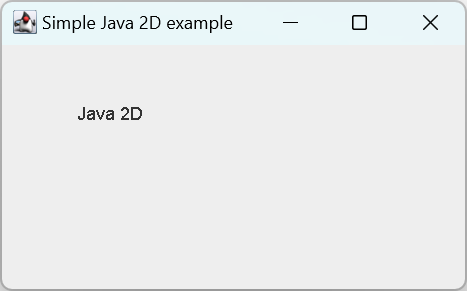

# Java 2D 基本概念

- [Java 2D 基本概念](#java-2d-基本概念)
  - [矢量图](#矢量图)
  - [Java 2D API](#java-2d-api)
  - [绘图机制](#绘图机制)
  - [Graphics 对象](#graphics-对象)
  - [示例](#示例)

2023-12-26, 15:12⭐
***

## 矢量图

有两种计算机图片：

- 矢量图（vector）：以点、线、曲线等基本几何图形表示图片，这些几何图元通过数学方程创建
- 光栅图（raster）：光栅图(位图)以像素点表示图片

两种类型的图片各有优缺点，矢量图的优点：

- 更小
- 不限制缩放
- 移动、缩放、填充、旋转等操作不降低图片质量

Java 2D API 提供了两种图片的处理工具。

## Java 2D API

Java 2D 是使用 Java 语言绘制二维图形的 API，提供如下功能：

- 为显示设备和打印机等提供了统一的渲染模型；
- 提供了大量的几何图元(geometric primitive)，如曲线(curves)、方形(rectangle)、椭圆(ellipse)，并包含几乎可生成任何几何图形的机制；
- 图形、文本和图像的 hit detection 机制；
- 用于重叠图像对象渲染的混合模型；
- 增强颜色支持；
- 打印复杂的文档；
- 渲染的质量控制。

Java 2D API 加强了 AWT 的图形文本功能，可以将 Java 2D 看做 AWT 的超集。

渲染的基本步骤：

1. 获取一个 `Graphics` 对象
2. 设置该 `Graphics` 的属性
3. 用 `Graphics` 绘图

## 绘图机制

自定义的绘制代码应该放在 `paintComponent()` 方法中，该方法在绘制时自动被调用。绘制系统会先调用 `paint()` 方法，该方法依次调用下面三个方法：

```java
paintComponent()
paintBorder()
paintChildren()
```

少数情况可能需要重写 `paintBorder()` 或 `paintChildren()` 方法，不过大多时候都只用覆盖 `paintComponent()` 方法。

## Graphics 对象

`paintComponent()` 的唯一参数为 `Graphics` 类型，该类包含许多绘制 2D 图形以及设置绘图参数的方法。

`Graphics2D` 类扩展 `Graphics`，它提供更多图形绘制、坐标轴转换、颜色管理、文本布局等更为精细的控制。Swing 几乎始终使用 `Graphics2D`。

`Graphics` 在传递给 `paintComponent()` 方法前已初始化，然后依次传递给 `paintBorder()` 和 `paintChildren()`。这样重用 `Graphics` 可提高性能，不过当参数设置不当，会导致问题。所以，要么恢复 `Graphics` 设置，要么创建 `Graphics` 的副本使用，使用 `Graphics` 的 `create()` 方法创建副本，记得最后用 `dispose()` 方法释放。

实际上，只使用 font, color, rendering-hints 属性不需要创建 `Graphics` 副本。其它属性，特别是剪辑(clip)、合成操作(composite)和转换(transformations)，则必须创建 `Graphics` 副本，使用后 `dispose` 掉。

## 示例

```java
import javax.swing.*;
import java.awt.*;

class Surface extends JPanel { // 在 JPanel 上绘制文本

    private void doDrawing(Graphics g) {
        Graphics2D gd = (Graphics2D) g; // Graphics2D 是绘制的基本类
        gd.drawString("Java 2D", 50, 50); // 在 panel 上绘制字符串
    }

    @Override
    protected void paintComponent(Graphics g) { // 自定义绘制都在 paintComponent 中
        super.paintComponent(g); // 这个大部分时候是必须的
        doDrawing(g);
    }
}

public class SimpleEx extends JFrame {

    public SimpleEx() {
        initUI();
    }

    private void initUI() {
        add(new Surface());
        setTitle("Simple Java 2D example");
        setSize(300, 200);
        setLocationRelativeTo(null);
        setDefaultCloseOperation(WindowConstants.EXIT_ON_CLOSE);
    }

    public static void main(String[] args) {
        EventQueue.invokeLater(() -> {
            SimpleEx ex = new SimpleEx();
            ex.setVisible(true);
        });
    }
}
```


