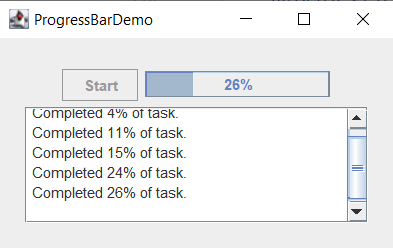
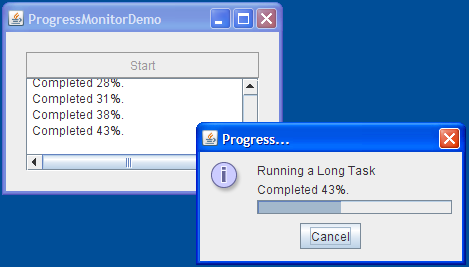

# JProgressBar

- [JProgressBar](#jprogressbar)
  - [简介](#简介)
  - [使用确定进度条](#使用确定进度条)
  - [不确定模式](#不确定模式)
  - [ProgressMonitor](#progressmonitor)
  - [参考](#参考)

2021-11-17, 16:01
***

## 简介

`JProgressBar` 用于指示任务执行进度。

显示进度的方式有两种，一种是确定进度多少：


一种不确定任务有多长，可以将其设置为 `indeterminate` 模式：


Swing 提供了三个进度条相关的类：

**JProgressBar**

进度条可视化组件。

**ProgressMonitor**

非可视化组件。该类监听任务进度，在需要时弹出去对话框显示进度。

**ProgressMonitorInputStream**

带进度监听的输入流，可以和常规输入流一样使用。可以通过 `gegtProgressMonitor` 获取流的进度监视器。

## 使用确定进度条

下面演示使用进度条查看任务进度：



```java
public class ProgressBarDemo extends JPanel
        implements ActionListener, PropertyChangeListener
{
    private JProgressBar progressBar;
    private JButton startButton;
    private JTextArea taskOutput;
    private Task task;

    class Task extends SwingWorker<Void, Void>
    {
        /*
         * Main task. Executed in background thread.
         */
        @Override
        public Void doInBackground()
        {
            Random random = new Random();
            int progress = 0;
            //Initialize progress property.
            setProgress(0);
            while (progress < 100) {
                //Sleep for up to one second.
                try {
                    Thread.sleep(random.nextInt(1000));
                } catch (InterruptedException ignore) {}
                //Make random progress.
                progress += random.nextInt(10);
                setProgress(Math.min(progress, 100));
            }
            return null;
        }

        /*
         * Executed in event dispatching thread
         */
        @Override
        public void done()
        {
            Toolkit.getDefaultToolkit().beep();
            startButton.setEnabled(true);
            setCursor(null); //turn off the wait cursor
            taskOutput.append("Done!\n");
        }
    }

    public ProgressBarDemo()
    {
        super(new BorderLayout());

        //Create the demo's UI.
        startButton = new JButton("Start");
        startButton.setActionCommand("start");
        startButton.addActionListener(this);

        // 初始化进度条
        progressBar = new JProgressBar(0, 100);
        progressBar.setValue(0);
        progressBar.setStringPainted(true);

        taskOutput = new JTextArea(5, 20);
        taskOutput.setMargin(new Insets(5, 5, 5, 5));
        taskOutput.setEditable(false);

        JPanel panel = new JPanel();
        panel.add(startButton);
        panel.add(progressBar);

        add(panel, BorderLayout.PAGE_START);
        add(new JScrollPane(taskOutput), BorderLayout.CENTER);
        setBorder(BorderFactory.createEmptyBorder(20, 20, 20, 20));

    }

    /**
     * Invoked when the user presses the start button.
     */
    public void actionPerformed(ActionEvent evt)
    {
        startButton.setEnabled(false);
        setCursor(Cursor.getPredefinedCursor(Cursor.WAIT_CURSOR));
        //Instances of javax.swing.SwingWorker are not reusuable, so
        //we create new instances as needed.
        task = new Task();
        task.addPropertyChangeListener(this);
        task.execute();
    }

    /**
     * Invoked when task's progress property changes.
     */
    public void propertyChange(PropertyChangeEvent evt)
    {
        if ("progress" == evt.getPropertyName()) {
            int progress = (Integer) evt.getNewValue();
            progressBar.setValue(progress);
            taskOutput.append(String.format(
                    "Completed %d%% of task.\n", task.getProgress()));
        }
    }


    /**
     * Create the GUI and show it. As with all GUI code, this must run
     * on the event-dispatching thread.
     */
    private static void createAndShowGUI()
    {
        //Create and set up the window.
        JFrame frame = new JFrame("ProgressBarDemo");
        frame.setDefaultCloseOperation(JFrame.EXIT_ON_CLOSE);

        //Create and set up the content pane.
        JComponent newContentPane = new ProgressBarDemo();
        newContentPane.setOpaque(true); //content panes must be opaque
        frame.setContentPane(newContentPane);

        //Display the window.
        frame.pack();
        frame.setVisible(true);
    }

    public static void main(String[] args)
    {
        //Schedule a job for the event-dispatching thread:
        //creating and showing this application's GUI.
        javax.swing.SwingUtilities.invokeLater(() -> createAndShowGUI());
    }
}
```

下面是初始化并设置进度条的代码：

```java
//Where member variables are declared:
JProgressBar progressBar;
...
//Where the GUI is constructed:
progressBar = new JProgressBar(0, task.getLengthOfTask());
progressBar.setValue(0);
progressBar.setStringPainted(true);
```

在 `JProgressBar` 构造函数中设置了进度条的最小值和最大值。也可以使用 `setMinimum` 和 `setMaximum` 设置。上例中使用的最小值为 0，最大值为 `task.getLengthOfTask()`，即任务长度。

设置 `setStringPainted` 表示在进度条上以文本显示任务的进度，默认将 `getPercentComplete` 方法返回的值以百分比显示，如 **66%**。可以通过 `setString` 方法自定义显示文本。例如：

```java
if (/*...half way done...*/)
    progressBar.setString("Half way there!");
```

点击 **Start** 按钮，会创建并执行 `Task`：

```java
public void actionPerformed(ActionEvent evt) {
    startButton.setEnabled(false);
    setCursor(Cursor.getPredefinedCursor(Cursor.WAIT_CURSOR));
    done = false;
    task = new Task();
    task.addPropertyChangeListener(this);
    task.execute();
}
```

`Task` 是 `javax.swing.SwingWorker` 的子类，其主要工作包括：

1. 在一个单独的线程执行 `doInBackground`；
2. 在后台线程完成后，在 EDT 中调用 `done` 方法；
3. 维护一个 `progress` 属性，更新该属性指示进度。每次调用 `serProgress` 都会触发`propertyChange` 方法。

`ProgressBarDemo` 的后台任务通过随机增加进度值模拟真实任务。`propertyChange` 方法通过更新进度条来响应进度属性的变化。

```java
public void propertyChange(PropertyChangeEvent evt) {
    if (!done) {
        int progress = task.getProgress();
        progressBar.setValue(progress);
        taskOutput.append(String.format("Completed %d%% of task.\n", progress));
    }
```

任务完成后，task 的 `done` 方法重置进度条：

```java
public void done() {
    Toolkit.getDefaultToolkit().beep();
    startButton.setEnabled(true);
    setCursor(null); //turn off the wait cursor
    taskOutput.append("Done!\n");
}
```

## 不确定模式

```java
import javax.swing.*;
import java.awt.*;
import java.awt.event.ActionEvent;
import java.awt.event.ActionListener;
import java.beans.PropertyChangeEvent;
import java.beans.PropertyChangeListener;
import java.util.Random;

public class ProgressBarDemo2 extends JPanel
        implements ActionListener, PropertyChangeListener
{
    private JProgressBar progressBar;
    private JButton startButton;
    private JTextArea taskOutput;
    private Task task;

    class Task extends SwingWorker<Void, Void>
    {
        /*
         * Main task. Executed in background thread.
         */
        @Override
        public Void doInBackground()
        {
            Random random = new Random();
            int progress = 0;
            //Initialize progress property.
            setProgress(0);
            //Sleep for at least one second to simulate "startup".
            try {
                Thread.sleep(1000 + random.nextInt(2000));
            } catch (InterruptedException ignore) {}
            while (progress < 100) {
                //Sleep for up to one second.
                try {
                    Thread.sleep(random.nextInt(1000));
                } catch (InterruptedException ignore) {}
                //Make random progress.
                progress += random.nextInt(10);
                setProgress(Math.min(progress, 100));
            }
            return null;
        }

        /*
         * Executed in event dispatch thread
         */
        public void done()
        {
            Toolkit.getDefaultToolkit().beep();
            startButton.setEnabled(true);
            taskOutput.append("Done!\n");
        }
    }

    public ProgressBarDemo2()
    {
        super(new BorderLayout());

        //Create the demo's UI.
        startButton = new JButton("Start");
        startButton.setActionCommand("start");
        startButton.addActionListener(this);

        progressBar = new JProgressBar(0, 100);
        progressBar.setValue(0);

        //Call setStringPainted now so that the progress bar height
        //stays the same whether or not the string is shown.
        progressBar.setStringPainted(true);

        taskOutput = new JTextArea(5, 20);
        taskOutput.setMargin(new Insets(5, 5, 5, 5));
        taskOutput.setEditable(false);

        JPanel panel = new JPanel();
        panel.add(startButton);
        panel.add(progressBar);

        add(panel, BorderLayout.PAGE_START);
        add(new JScrollPane(taskOutput), BorderLayout.CENTER);
        setBorder(BorderFactory.createEmptyBorder(20, 20, 20, 20));
    }

    /**
     * Invoked when the user presses the start button.
     */
    public void actionPerformed(ActionEvent evt)
    {
        progressBar.setIndeterminate(true);
        startButton.setEnabled(false);
        //Instances of javax.swing.SwingWorker are not reusuable, so
        //we create new instances as needed.
        task = new Task();
        task.addPropertyChangeListener(this);
        task.execute();
    }

    /**
     * Invoked when task's progress property changes.
     */
    public void propertyChange(PropertyChangeEvent evt)
    {
        if ("progress" == evt.getPropertyName()) {
            int progress = (Integer) evt.getNewValue();
            progressBar.setIndeterminate(false);
            progressBar.setValue(progress);
            taskOutput.append(String.format("Completed %d%% of task.\n", progress));
        }
    }

    /**
     * Create the GUI and show it. As with all GUI code, this must run
     * on the event-dispatching thread.
     */
    private static void createAndShowGUI()
    {
        //Create and set up the window.
        JFrame frame = new JFrame("ProgressBarDemo2");
        frame.setDefaultCloseOperation(JFrame.EXIT_ON_CLOSE);

        //Create and set up the content pane.
        JComponent newContentPane = new ProgressBarDemo2();
        newContentPane.setOpaque(true); //content panes must be opaque
        frame.setContentPane(newContentPane);

        //Display the window.
        frame.pack();
        frame.setVisible(true);
    }

    public static void main(String[] args)
    {
        javax.swing.SwingUtilities.invokeLater(() -> createAndShowGUI());
    }
}
```

## ProgressMonitor

```java
package mjw.study.swing;

import javax.swing.*;
import java.awt.*;
import java.awt.event.ActionEvent;
import java.awt.event.ActionListener;
import java.beans.PropertyChangeEvent;
import java.beans.PropertyChangeListener;
import java.util.Random;

public class ProgressMonitorDemo extends JPanel
        implements ActionListener, PropertyChangeListener
{

    private ProgressMonitor progressMonitor;
    private JButton startButton;
    private JTextArea taskOutput;
    private Task task;

    class Task extends SwingWorker<Void, Void>
    {
        @Override
        public Void doInBackground()
        {
            Random random = new Random();
            int progress = 0;
            setProgress(0);
            try {
                Thread.sleep(1000);
                while (progress < 100 && !isCancelled()) {
                    //Sleep for up to one second.
                    Thread.sleep(random.nextInt(1000));
                    //Make random progress.
                    progress += random.nextInt(10);
                    setProgress(Math.min(progress, 100));
                }
            } catch (InterruptedException ignore) {}
            return null;
        }

        @Override
        public void done()
        {
            Toolkit.getDefaultToolkit().beep();
            startButton.setEnabled(true);
            progressMonitor.setProgress(0);
        }
    }

    public ProgressMonitorDemo()
    {
        super(new BorderLayout());

        //Create the demo's UI.
        startButton = new JButton("Start");
        startButton.setActionCommand("start");
        startButton.addActionListener(this);

        taskOutput = new JTextArea(5, 20);
        taskOutput.setMargin(new Insets(5, 5, 5, 5));
        taskOutput.setEditable(false);

        add(startButton, BorderLayout.PAGE_START);
        add(new JScrollPane(taskOutput), BorderLayout.CENTER);
        setBorder(BorderFactory.createEmptyBorder(20, 20, 20, 20));

    }


    /**
     * Invoked when the user presses the start button.
     */
    public void actionPerformed(ActionEvent evt)
    {
        progressMonitor = new ProgressMonitor(ProgressMonitorDemo.this,
                "Running a Long Task",
                "", 0, 100);
        progressMonitor.setProgress(0);
        task = new Task();
        task.addPropertyChangeListener(this);
        task.execute();
        startButton.setEnabled(false);
    }

    /**
     * Invoked when task's progress property changes.
     */
    public void propertyChange(PropertyChangeEvent evt)
    {
        if ("progress" == evt.getPropertyName()) {
            int progress = (Integer) evt.getNewValue();
            progressMonitor.setProgress(progress);
            String message =
                    String.format("Completed %d%%.\n", progress);
            progressMonitor.setNote(message);
            taskOutput.append(message);
            if (progressMonitor.isCanceled() || task.isDone()) {
                Toolkit.getDefaultToolkit().beep();
                if (progressMonitor.isCanceled()) {
                    task.cancel(true);
                    taskOutput.append("Task canceled.\n");
                } else {
                    taskOutput.append("Task completed.\n");
                }
                startButton.setEnabled(true);
            }
        }

    }

    /**
     * Create the GUI and show it.  For thread safety,
     * this method should be invoked from the
     * event-dispatching thread.
     */
    private static void createAndShowGUI()
    {
        //Create and set up the window.
        JFrame frame = new JFrame("ProgressMonitorDemo");
        frame.setDefaultCloseOperation(JFrame.EXIT_ON_CLOSE);

        //Create and set up the content pane.
        JComponent newContentPane = new ProgressMonitorDemo();
        newContentPane.setOpaque(true); //content panes must be opaque
        frame.setContentPane(newContentPane);

        //Display the window.
        frame.pack();
        frame.setVisible(true);
    }

    public static void main(String[] args)
    {
        //Schedule a job for the event-dispatching thread:
        //creating and showing this application's GUI.
        javax.swing.SwingUtilities.invokeLater(new Runnable()
        {
            public void run()
            {
                createAndShowGUI();
            }
        });
    }
}
```



`ProgressMonitor` 不能复用，因此每次开始任务时新创建。下面是创建 `ProgressMonitor` 的代码：

```java
progressMonitor = new ProgressMonitor(ProgressMonitorDemo.this,
                                      "Running a Long Task",
                                      "", 0, task.getLengthOfTask());
```

- 第一个参数是父组件，用于控制弹窗出现的位置；
- 第二个参数是任务的描述字符串，该字符串会在弹窗中显示；
- 


## 参考

- https://docs.oracle.com/javase/tutorial/uiswing/components/progress.html
