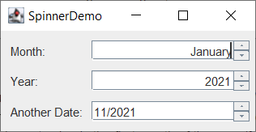

# JSpinner

- [JSpinner](#jspinner)
  - [简介](#简介)
  - [模型](#模型)
  - [编辑器](#编辑器)
  - [例 1](#例-1)

2021-11-25, 13:22
***
## 简介

`JSpinner` 和 `JComboBox`, `JList` 类似，允许用户从一系列值中做选择。与可编辑的 `JComboBox` 一样，`JSpinner` 允许直接键入值。

和 `JComboBox` 不同的是，`JSpinner` 没有下拉列表，它只显示当前值。

**使用情形**：当可选择的值很多，使用列表显示不方便时可使用 `JSpinner`。

`JSpinner` 组件由三个组件组成：2 个按钮和一个编辑器。编辑器可以是任意 `JComponent`，其默认实现了包含 `JFormattedTextField` 的 panel。

`JSpinner` 的可选值和当前值由 `SpinnerModel` 控制。

## 模型

Swign 提供了三个 `JSpinner` 模型。

- `SpinnerListModel` 的值由对象数组或 `List` 定义，例如：

```java
String[] monthStrings = getMonthStrings(); //get month names
SpinnerListModel monthModel = new SpinnerListModel(monthStrings);
JSpinner spinner = new JSpinner(model);
```

- `SpinnerNumberModel` 支持 `double`, `int` 或 `Number` 对象，可以指定最小值、最大值和 step 值。例如：

```java
SpinnerModel model =
        new SpinnerNumberModel(currentYear, //初始值
                               currentYear - 100, // 最小值
                               currentYear + 100, // 最大值
                               1);                // step
```

- `SpinnerDateModel` 支持 `Date` 序列。可以指定最小日期、最大日期 ，以及对哪个字段执行递增或递减操作（如 `Calendar.YEAR`）。此处需要注意的是，部分 L&F 会忽略指定的字段，而是对选择的字段进行操作。示例：

```java
Date initDate = calendar.getTime();
calendar.add(Calendar.YEAR, -100);
Date earliestDate = calendar.getTime();
calendar.add(Calendar.YEAR, 200);
Date latestDate = calendar.getTime();
model = new SpinnerDateModel(initDate,
                             earliestDate,
                             latestDate,
                             Calendar.YEAR);
```

在设置模型时，会自动设置匹配的编辑器。Swing 为每种类型的模型都提供了编辑器。分别为：

- `JSpinner.ListEditor`
- `JSpinner.NumberEditor`
- `JSpinner.DateEditor`

这三个类都是 `JSpinner.DefaultEditor` 的子类，该类可编辑格式化字段。如果使用没有对应编辑器的模型，则默认使用 `JSpinner.DefaultEditor`，用于不可编辑的格式化字段。

如果现有的模型或编辑器无法满足要求，完全可以自己来创建。

创建自定义模型最简单的方式是扩展 `AbstractSpinnerModel` 类。

## 编辑器

可以通过创建和设置编辑器实现自定义格式化。

`JSpinner.NumberEditor` 和 `JSpinner.DateEditor` 可以指定格式化样式。例如，指定日期的显示方式：

```java
spinner.setEditor(new JSpinner.DateEditor(spinner, "MM/yyyy"));
```

如果使用 `DefaultEditor`，可以调用其 `JFormattedTextField` 的方法，使用 `getTextField()` 获取 `JFormattedTextField` 示例，例如：

```java
//Tweak the spinner's formatted text field.
ftf = getTextField(spinner);
if (ftf != null ) {
    ftf.setColumns(8); //specify more width than we need
    ftf.setHorizontalAlignment(JTextField.RIGHT);
}
...

// 下面需要注意，`DefaultEditor` 不是 `JFormattedTextField`，而是 `JPanel`
public JFormattedTextField getTextField(JSpinner spinner) {
    JComponent editor = spinner.getEditor();
    if (editor instanceof JSpinner.DefaultEditor) {
        return ((JSpinner.DefaultEditor)editor).getTextField();
    } else {
        System.err.println("Unexpected editor type: "
                           + spinner.getEditor().getClass()
                           + " isn't a descendant of DefaultEditor");
        return null;
    }
}
```

## 例 1



如图所示，包含三个 `JSpinner`：

- Month `JSpinner` 显示第一个月的名称，可选值使用字符串数组指定；
- Year `JSpinner` 

[DateSpinner](../src/main/java/mjw/swing/spinner/DateSpinner.java)
