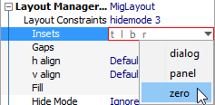
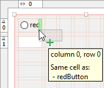
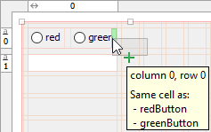
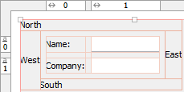

# MigLayout

## 简介

MigLayout 是一个通用且强大的 layout-manager。MigLayout 基于 grid，但也支持 docking 和 grouping。

相对其它 layout-managers，MigLayout 有如下优势：

- column/row 中组件默认对齐；
- 可以指定 column width 或 row height 的最小和最大值；
- 支持不同单位：LogicalPixel, Pixel, Point, Millimeter, Centimeter, Inch, Percent and ScreenPercent，其中 LogicalPixel 对创建随屏幕分辨率缩放的布局非常有用；
- 支持 columns, rows 以及 components 之间的 gaps；
- 灵活的 growing and shrinking；
- column/row grouping；
- in-cell flow 支持将多个 component 放入单个 grid-cell；
- 将组件 docking 到容器边缘；

## Insets

所有 MigLayout 容器默认在网格周围插入 insets。类似于为容器设置 `EmptyBorder`。

|Default insets(panel)|Zero insets|
|---|---|
|||

设置界面：

## In-cell Flow

MigLayout 支持在一个 cell 里放置多个组件。这对使用 radioButtonGroup 非常有用，避免嵌套容器。

|1|2|3|
|---|---|---|
||||

## Docking Components

MigLayout 支持将组件停靠在它的边缘（类似 BorderLayout）。可以将多个组件停靠在一个边。中间为 grid 分布。

|Order:north,west,south,east|Order:east,south,west,north|
|---|---|
|||

## 示例

## 参考

- https://www.formdev.com/jformdesigner/doc/layouts/miglayout/
- https://www.formdev.com/jformdesigner/doc/layouts/miglayout-whitepaper/#button-bars-and-button-order