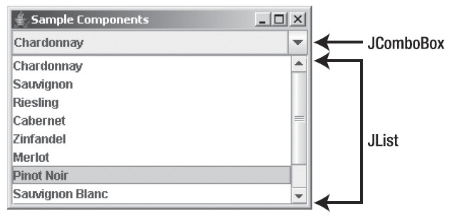
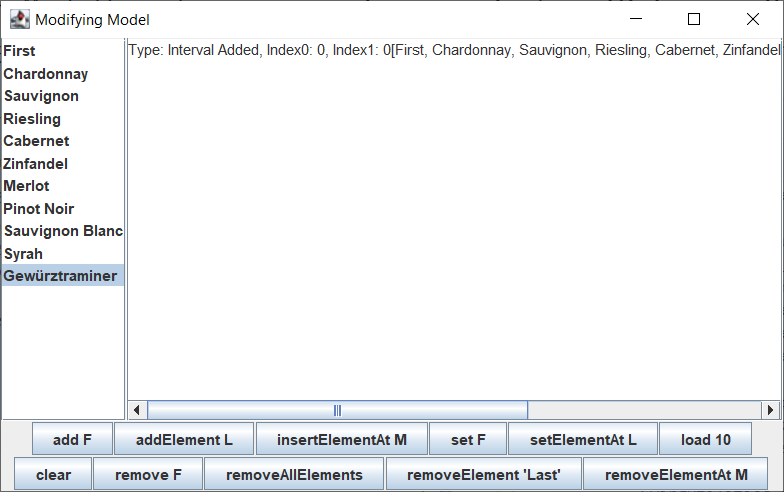

# List 模型控件

- [List 模型控件](#list-模型控件)
  - [简介](#简介)
  - [ListModel 接口](#listmodel-接口)
    - [AbstractListModel](#abstractlistmodel)
    - [DefaultListModel](#defaultlistmodel)
    - [ListDataListener 监听事件](#listdatalistener-监听事件)
    - [ComboBoxModel 接口](#comboboxmodel-接口)
    - [MutableComboBoxModel](#mutablecomboboxmodel)
    - [DefaultComboBoxModel](#defaultcomboboxmodel)
  - [JList](#jlist)
    - [创建 JList](#创建-jlist)
  - [JComboBox](#jcombobox)
    - [创建 JComboBox](#创建-jcombobox)
    - [属性](#属性)
    - [JComboBox cell 渲染](#jcombobox-cell-渲染)
    - [选择 JComboBox 元素](#选择-jcombobox-元素)
    - [事件处理](#事件处理)

2021-11-17, 09:56
***

## 简介

下面介绍两个显示列表数据的控件：`JList` 和 `JComboBox`。两者的主要区别在于 `JList` 支持多选，而 `JComboBox` 不支持。此外，`JComboBox` 允许提供可用选项之外的选择。如下所示：



## ListModel 接口

这两个组件共享数据模型接口 `ListModel`。`AbstractListModel` 实现了一组 `ListDataListener` 对象的管理和通知，提供了一个实现基础。

对 `JList`，其数据模型默认实现为 `DefaultListModel` 类，添加了数据存储功能。

对 `JComboBox`，其数据模型接口 `ComboBoxModel` 扩展 `ListModel` 接口，默认实现为 `DefafultComboBoxModel`。

实际的 `ListModel` 接口十分简单，如下：

```java
public interface ListModel<E>
{
  /**
   * Returns the length of the list.
   * @return the length of the list
   */
  int getSize();

  /**
   * Returns the value at the specified index.
   * @param index the requested index
   * @return the value at <code>index</code>
   */
  E getElementAt(int index);

  /**
   * Adds a listener to the list that's notified each time a change
   * to the data model occurs.
   * @param l the <code>ListDataListener</code> to be added
   */
  void addListDataListener(ListDataListener l);

  /**
   * Removes a listener from the list that's notified each time a
   * change to the data model occurs.
   * @param l the <code>ListDataListener</code> to be removed
   */
  void removeListDataListener(ListDataListener l);
}
```

### AbstractListModel

`AbstractListModel` 部分实现了 `ListModel` 接口。下面只需要自定义实现数据结构。该类提供了 `ListDataListener` 对象的列表管理，以及在数据更改时通知监听器。

- 返回注册到模型的所有列表数据监听器

```java
public ListDataListener[] getListDataListeners()
```

在修改数据后，需要调用合适的方法通知监听器，通知的方法如下：

> 下面方法中 `index0` 和 `index1` 都是闭区间索引，即包含索引对应的元素。而且 `index0` 不需要比 `index1` 小，它们只是指定两个端点。

- `AbstractListModel` 子类在添加一个或多个元素到模型后，必须调用该方法。这里 `index0` 和 `index1` 为闭区间。

```java
protected void fireIntervalAdded(Object source, int index0, int index1)
```

- `AbstractListModel` 子类删除一个或多个元素之后，需要调用该方法。

```java
protected void fireIntervalRemoved(Object source, int index0, int index1)
```

- 元素发生改变后调用该方法。

```java
protected void fireContentsChanged(Object source, int index0, int index1)
```

如果你已有数据，需要将其转换为 Swing 组件支持的数据结构，或者自定义实现 `ListModel` 接口。`JList` 和 `JComboBox` 直接支持数组和 `Vector`。对其它数据结构，如 `ArrayList`，可以先将其转换为数组或 `Vector`，也可以按如下方式扩展 `AbstractListModel`：

```java
final List arrayList = ...;
ListModel model = new AbstractListModel() {
    public int getSize() {
        return arrayList.size();
    }
    public Object getElementAt(int index) {
        return arrayList.get(index);
    }
}
```

### DefaultListModel

`DefaultListModel` 内部以 `Vector` 存储数据，相对 `AbstractListModel` 只额外加了一个字段：

```java
private Vector<E> delegate = new Vector<E>();
```

余下所有的方法都是对数据 `delegate` 的操作。使用该类和 `Vector` 操作类似，事件相关 `DefaultListModel` 都已处理。

### ListDataListener 监听事件

如果你想监听列表内容的更改，可以注册 `ListDataListener`，这是一个很简单的接口，监听添加元素、删除元素和元素更改事件：

```java
public interface ListDataListener extends EventListener {

    /**
     * Sent after the indices in the index0,index1
     * interval have been inserted in the data model.
     * The new interval includes both index0 and index1.
     *
     * @param e  a <code>ListDataEvent</code> encapsulating the
     *    event information
     */
    void intervalAdded(ListDataEvent e);


    /**
     * Sent after the indices in the index0,index1 interval
     * have been removed from the data model.  The interval
     * includes both index0 and index1.
     *
     * @param e  a <code>ListDataEvent</code> encapsulating the
     *    event information
     */
    void intervalRemoved(ListDataEvent e);


    /**
     * Sent when the contents of the list has changed in a way
     * that's too complex to characterize with the previous
     * methods. For example, this is sent when an item has been
     * replaced. Index0 and index1 bracket the change.
     *
     * @param e  a <code>ListDataEvent</code> encapsulating the
     *    event information
     */
    void contentsChanged(ListDataEvent e);
}
```

`ListDataEvent` 包含事件信息，该类含有三个属性值：

|属性|说明|
|---|---|
|index0|列表更改的起始位置|
|index1|列表更改的结束位置
|type|事件类型|

`type` 指定实现类型，对应三个常量：

- `CONTENTS_CHANGED`
- `INTERVAL_ADDED`
- `INTERVAL_REMOVED`

下面通过一个实例看 `ListDataListener` 的用法：

```java
public class ModifyModelSample
{
    static String[] labels = {"Chardonnay", "Sauvignon", "Riesling", "Cabernet",
            "Zinfandel", "Merlot", "Pinot Noir", "Sauvignon Blanc", "Syrah",
            "Gewürztraminer"};

    public static void main(String[] args)
    {
        Runnable runner = () -> {
            JFrame frame = new JFrame("Modifying Model");
            frame.setDefaultCloseOperation(JFrame.EXIT_ON_CLOSE);
            // 填充数据
            final DefaultListModel<String> model = new DefaultListModel<>();
            for (String label : labels) {
                model.addElement(label);
            }
            JList<String> jlist = new JList<>(model);
            JScrollPane scrollPane1 = new JScrollPane(jlist);
            frame.add(scrollPane1, BorderLayout.WEST);

            final JTextArea textArea = new JTextArea();
            textArea.setEditable(false);
            JScrollPane scrollPane2 = new JScrollPane(textArea);
            frame.add(scrollPane2, BorderLayout.CENTER);

            ListDataListener listDataListener = new ListDataListener()
            {
                public void contentsChanged(ListDataEvent listDataEvent)
                {
                    appendEvent(listDataEvent);
                }

                public void intervalAdded(ListDataEvent listDataEvent)
                {
                    appendEvent(listDataEvent);
                }

                public void intervalRemoved(ListDataEvent listDataEvent)
                {
                    appendEvent(listDataEvent);
                }

                private void appendEvent(ListDataEvent listDataEvent)
                {
                    StringWriter sw = new StringWriter();
                    PrintWriter pw = new PrintWriter(sw);
                    switch (listDataEvent.getType()) {
                        case ListDataEvent.CONTENTS_CHANGED:
                            pw.print("Type: Contents Changed");
                            break;
                        case ListDataEvent.INTERVAL_ADDED:
                            pw.print("Type: Interval Added");
                            break;
                        case ListDataEvent.INTERVAL_REMOVED:
                            pw.print("Type: Interval Removed");
                            break;
                    }
                    pw.print(", Index0: " + listDataEvent.getIndex0());
                    pw.print(", Index1: " + listDataEvent.getIndex1());
                    DefaultListModel<String> theModel = (DefaultListModel) listDataEvent.getSource();
                    pw.println(theModel);
                    textArea.append(sw.toString());
                }
            };
            model.addListDataListener(listDataListener);

            // Set up buttons
            JPanel jp = new JPanel(new GridLayout(2, 1));
            JPanel jp1 = new JPanel(new FlowLayout(FlowLayout.CENTER, 1, 1));
            JPanel jp2 = new JPanel(new FlowLayout(FlowLayout.CENTER, 1, 1));
            jp.add(jp1);
            jp.add(jp2);

            // 添加元素到开头
            JButton jb = new JButton("add F");
            jp1.add(jb);
            jb.addActionListener(actionEvent -> model.add(0, "First")); 

            // 添加元素到末尾
            jb = new JButton("addElement L");
            jp1.add(jb);
            jb.addActionListener(actionEvent -> model.addElement("Last"));
            
            // 添加元素到中间
            jb = new JButton("insertElementAt M");
            jp1.add(jb);
            jb.addActionListener(actionEvent -> {
                int size = model.getSize();
                model.insertElementAt("Middle", size / 2);
            });

            // 修改开头元素
            jb = new JButton("set F");
            jp1.add(jb);
            jb.addActionListener(actionEvent -> {
                int size = model.getSize();
                if (size != 0)
                    model.set(0, "New First");
            });

            // 修改末尾元素
            jb = new JButton("setElementAt L");
            jp1.add(jb);
            jb.addActionListener(actionEvent -> {
                int size = model.getSize();
                if (size != 0)
                    model.setElementAt("New Last", size - 1);
            });

            // 添加 10 个新元素
            jb = new JButton("load 10");
            jp1.add(jb);
            jb.addActionListener(actionEvent -> {
                for (String label : labels) {
                    model.addElement(label);
                }
            });

            // 清空元素
            jb = new JButton("clear");
            jp2.add(jb);
            jb.addActionListener(actionEvent -> model.clear());
            
            // 移除第一个元素
            jb = new JButton("remove F");
            jp2.add(jb);
            jb.addActionListener(actionEvent -> {
                int size = model.getSize();
                if (size != 0)
                    model.remove(0);
            });

            // 删除所有元素，和 clear 功能一样
            jb = new JButton("removeAllElements");
            jp2.add(jb);
            jb.addActionListener(actionEvent -> model.removeAllElements());
            
            // 删除 'Last' 元素
            jb = new JButton("removeElement 'Last'");
            jp2.add(jb);
            jb.addActionListener(actionEvent -> model.removeElement("Last"));
            
            // 删除中间元素
            jb = new JButton("removeElementAt M");
            jp2.add(jb);
            jb.addActionListener(actionEvent -> {
                int size = model.getSize();
                if (size != 0)
                    model.removeElementAt(size / 2);
            });

            // 删除前面一般元素
            jb = new JButton("removeRange FM");
            jp2.add(jb);
            jb.addActionListener(actionEvent -> {
                int size = model.getSize();
                if (size != 0)
                    model.removeRange(0, size / 2);
            });
            frame.add(jp, BorderLayout.SOUTH);
            frame.setSize(640, 300);
            frame.setVisible(true);
        };
        SwingUtilities.invokeLater(runner);
    }
}
```

界面如下：



- 左侧显示的列表；
- 右侧 `TextArea` 显示事件；
- 下面的按钮用于修改列表，从而产生事件；
- `listDataListener` 监听列表，并将时间信息输出到右侧的 `TextArea`。

### ComboBoxModel 接口

`ComboBoxModel` 接口扩展 `ListModel` 接口，添加了两个方法：

```java
public interface ComboBoxModel<E> extends ListModel<E> {

  /**
   * Set the selected item. The implementation of this  method should notify
   * all registered <code>ListDataListener</code>s that the contents
   * have changed.
   *
   * @param anItem the list object to select or <code>null</code>
   *        to clear the selection
   */
  void setSelectedItem(Object anItem);

  /**
   * Returns the selected item
   * @return The selected item or <code>null</code> if there is no selection
   */
  Object getSelectedItem();
}
```

这两个方法便于使用 `selectedItem` 属性管理选中的项目。

### MutableComboBoxModel

`MutableComboBoxModel` 扩展 `ComboBoxModel`，使其可以修改列表。`JComboBox` 默认实现该接口。

```java
public interface MutableComboBoxModel<E> extends ComboBoxModel<E> {

    /**
     * Adds an item at the end of the model. The implementation of this method
     * should notify all registered <code>ListDataListener</code>s that the
     * item has been added.
     *
     * @param item the item to be added
     */
    public void addElement( E item );

    /**
     * Removes an item from the model. The implementation of this method should
     * should notify all registered <code>ListDataListener</code>s that the
     * item has been removed.
     *
     * @param obj the <code>Object</code> to be removed
     */
    public void removeElement( Object obj );

    /**
     * Adds an item at a specific index.  The implementation of this method
     * should notify all registered <code>ListDataListener</code>s that the
     * item has been added.
     *
     * @param item  the item to be added
     * @param index  location to add the object
     */
    public void insertElementAt( E item, int index );

    /**
     * Removes an item at a specific index. The implementation of this method
     * should notify all registered <code>ListDataListener</code>s that the
     * item has been removed.
     *
     * @param index  location of the item to be removed
     */
    public void removeElementAt( int index );
}
```

### DefaultComboBoxModel

`DefaultComboBoxModel` 类扩展 `AbstractListModel`类，为 `JComboBox` 提供数据模型。继承了 `ListDataListener` 列表管理。

其内部实现有两个关键字段：

```java
Vector<E> objects;
Object selectedObject;
```

`objects` 存储数据，`selectedObject` 存储选择的数据。

余下部分和 `DefaultListModel` 基本一致。

大多时候使用 `DefaultComboBoxModel` 就够了，不过有一个例外，如果你想支持同个元素出现多次，但是模型中设置选择元素时有 `equals` 判定，如下：

```java
public void setSelectedItem(Object anObject) {
    if ((selectedObject != null && !selectedObject.equals( anObject )) ||
        selectedObject == null && anObject != null) {
        selectedObject = anObject;
        fireContentsChanged(this, -1, -1);
    }
}
```

此时就无法从一个元素跳转到和它相同的元素，如果需要该功能，就需要自定义模型了。

如果要自定义模型，可以和 `DefaultComboBoxModel` 一样，扩展 `AbstractListModel`，并实现 `MutableComboBoxModel` 或 `ComboBoxModel` 接口，然后只需要提供数据结构存储数据，以及一个单独的字段保存选择的元素。

下面使用 `ArrayList` 作为底层数据结构自定义实现一个 `ComboBoxModel`：

```java
public class ArrayListComboBoxModel extends AbstractListModel implements ComboBoxModel
{
    private Object selectedItem;
    private ArrayList anArrayList;

    public ArrayListComboBoxModel(ArrayList arrayList)
    {
        anArrayList = arrayList;
    }
    
    @Override
    public Object getSelectedItem()
    {
        return selectedItem;
    }

    @Override
    public void setSelectedItem(Object newValue)
    {
        selectedItem = newValue;
    }

    @Override
    public int getSize()
    {
        return anArrayList.size();
    }

    @Override
    public Object getElementAt(int i)
    {
        return anArrayList.get(i);
    }

    public static void main(String[] args)
    {
        Runnable runner = () -> {
            JFrame frame = new JFrame("ArrayListComboBoxModel");
            frame.setDefaultCloseOperation(JFrame.EXIT_ON_CLOSE);
            
            Collection<Object> col = System.getProperties().values();
            ArrayList<Object> arrayList = new ArrayList<>(col);
            ArrayListComboBoxModel model = new ArrayListComboBoxModel(arrayList);
            JComboBox comboBox = new JComboBox(model);
            frame.add(comboBox, BorderLayout.NORTH);
            frame.setSize(300, 225);
            frame.setVisible(true);
        };
        SwingUtilities.invokeLater(runner);
    }
}
```

相对 `DefaultComboBoxModel`，已实现的方法主要有三点：

- 底层数据从 `Vector` 变为 `ArrayList`；
- 需改元素没有发出事件；
- 没有了边界检查。

## JList

`JList` 组件提供从一组选项中选择一个或多个元素的功能。`JList` 结构特征主要有三点：

- 数据模型 `ListModel` 用于保存数据；
- `ListCellRenderer` 用于渲染列表 cell；
- `ListSelectionModel` 元素选择模型。

### 创建 JList

`JList` 提供了 4 个构造函数：

- 创建空的 `JList`，只读模型

```java
public JList()
```

- 创建包含指定元素的 `JList`，只读模型

```java
public JList(final E[] listData)
```

- 以指定数据创建 `JList`，只读模型

```java
public JList(final Vector<? extends E> listData)
```

- 以指定 `ListModel` 创建 `JList`，其它构造函数都是在此基础上构造的

```java
public JList(ListModel<E> dataModel)
```

该构造函数将列表注册到 `ToolTipManager`，所以可以给 cell 提供 tooltips 功能。

## JComboBox

`JComboBox` 是一个组合组件，允许用户从一个下拉列表中从一组预定义选项进行选择。

`JComboBox` 实现由 4 部分组成：

- 数据模型 `ComboBoxModel`；
- cell 渲染 `ListCellRenderer`；
- 字段编辑 `ComboBoxEditor`；
- 使用键盘选择的模型 `KeySelectionManager`。

### 创建 JComboBox

### 属性

`maximumRowCount`， 弹窗中可见元素个数。

### JComboBox cell 渲染

`JComboBox` cell 渲染使用 `ListCellRenderer` 实现，和 `JList` 相同。

### 选择 JComboBox 元素

`JComboBox` 至少支持三种不同和选择相关的事件。

### 事件处理

JComboBox 的事件分为两种：

- 取得用户选择的项目，使用 `ItemListener`；
- 自定输入完毕后回车，使用 `ActionListener`。

