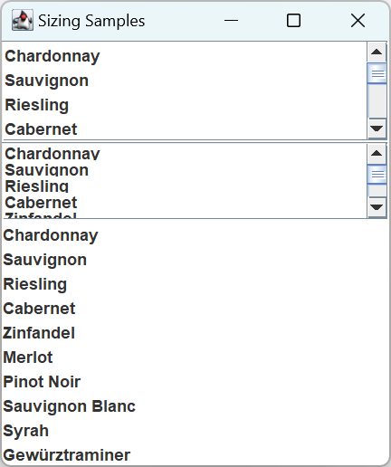
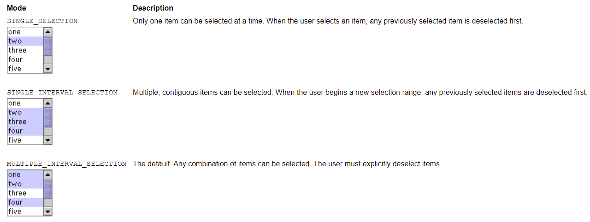

# JList

- [JList](#jlist)
  - [简介](#简介)
  - [创建 JList](#创建-jlist)
  - [JList 属性](#jlist-属性)
  - [滚动 JList](#滚动-jlist)
  - [渲染 JList 元素](#渲染-jlist-元素)
    - [更复杂的 ListCellRenderer 实现](#更复杂的-listcellrenderer-实现)
  - [创建 List](#创建-list)
  - [选择 Item](#选择-item)
  - [添加和删除项](#添加和删除项)
  - [参考](#参考)

2021-11-25, 09:29
***

## 简介

`JList` 组件提供从一组选项中单选和多选的功能。`JList` 结构特征有三点：

- 数据模型 `ListModel` 用于保存数据；
- `ListCellRenderer` 用于渲染列表 cell；
- `ListSelectionModel` 用于元素选择模型。

## 创建 JList

`JList` 提供了 4 个构造函数：

- 创建空的 `JList`，只读模型

```java
public JList()
```

- 创建包含指定元素的 `JList`，只读模型

```java
public JList(final E[] listData)
```

- 以指定数据创建 `JList`，只读模型

```java
public JList(final Vector<? extends E> listData)
```

- 以指定 `ListModel` 创建 `JList`，其它构造函数都是在此基础上构造的

```java
public JList(ListModel<E> dataModel)
```

说明：

- 如果使用无参构造函数，则可以稍后填充数据。
- 使用数组或 `Vector` 初始化 `JList`，构造函数隐式创建一个默认的 `ListModel`，该模型是 **immutable** 的，即不可以添加、删除或替换列表中的元素。
- 如果要创建可修改的模型，可以设置 mutable list model 类，如 `DefaultListModel`。在初始化 `JList` 时或调用 `setModel` 方法可以设置模型。


该构造函数将列表注册到 `ToolTipManager`，所以可以给 cell 提供 tooltips 功能。

## JList 属性

|属性|类型|权限|
|---|---|---|
|`accessibleContext`|AccessibleContext|Read-only|
|`anchorSelectionIndex`|int|Read-only|
|`cellRenderer`|ListCellRenderer|Read-write bound|
|`dragEnabled`|boolean|Read-write|
|`firstVisibleIndex`|int|Read-only|
|`fixedCellHeight`|int|Read-write bound|
|`fixedCellWidth`|int|Read-write bound|
|lastVisibleIndex|int|Read-only|
|layoutOrientation|int|Read-write bound|
|leadSelectionIndex|int|Read-only|
|listData|Vector|Write-only|
|listSelectionListeners|ListSelectionListener[]|Read-only|
|maxSelectionIndex|int|Read-only|
|minSelectionIndex|int|Read-only|
|model|ListModel|Read-write bound|
|`preferredScrollableViewportSize`|`Dimension`|Read-only|
|`prototypeCellValue`|`Object`|Read-write bound|
|scrollableTracksViewportHeight|boolean|Read-only|
|scrollableTracksViewportWidth|boolean|Read-only|
|selectedIndex|int|Read-write|
|selectedIndices|int[]|Read-write|
|selectedValue|Object|Read-only|
|selectedValues|Object[]|Read-only|
|selectionBackground|Color|Read-write bound|
|selectionEmpty|boolean|Read-only|
|selectionForeground|Color|Read-write bound|
|selectionMode|int|Read-write|
|selectionModel|ListSelectionModel|Read-write bound|
|UI|ListUI|Read-write|
|UIClassID|String|Read-only|
|valueIsAdjusting|boolean|Read-write|
|visibleRowCount|int|Read-write bound|

`JList` 的大多属性与选择有关。例如，`anchorSelectionIndex`, `leadSelectionIndex`, `maxSelectionIndex`, `minSelectionIndex`, `selectedIndex` 和 `selectedIndices` `处理所选行的索引；selectedValue` 和 `selectedValues` 与所选元素的内容有关。

`anchorSelectionIndex` 是 `ListDataEvent` 最近的 `index0` 值；`leadSelectionIndex` 是最近的 `index1` 值。

`visibleRowCount` 属性控制限制的 row 数目，默认为 8。

## 滚动 JList

使用 `JList` 时，如果希望允许用户从所有可选项中选择，则必须将 `JList` 放在 `JScrollPane` 中。如果不将 JList 放在 `JScrollPane`，且默认显示的 rows 数小于数据个数，或没有足够空间，则无法显示余下选项。

> 实现 `Scrollable` 接口的组件，都推荐放在 `JScrollPane` 中。

`JScrollPane` 通过 `preferredScrollableViewportSize` 属性确定尺寸：

- 当 JList 的数据模型为空，每个 row 默认尺寸为高 16 pixels，宽 256 pixels
- 否则遍历所有数据，宽度设置为最宽的 cell 的宽度，高度为第一个 cell 的高度

可以通过设置 `prototypeCellValue` 属性定义原型 cell 来加快 `JScrollPane` 调整大小过程。你必须确保原型 cell 的 toString() 值足够宽和高，以容纳 `JList` 的所有内容。`JScrollPane` 根据原型确定其 viewport 大小，不需要遍历所有数据。

也可以通过设置 `fixedCellHeight` 和 `fixedCellWidth` 属性分配大小来提高性能。设置这两个属性也能避免 JList 遍历所有数据来确定 cell 尺寸，是让 JList 确定 viewport 最快的方式，但也最不灵活。因此它不会根据内容调整 cell 大小。但是，如果数据模型中有大量选项，那么损失这种灵活性来提高性能是值得的。

**示例：** 调整尺寸策略

- 中间的 `JList` 包含 1000 个固定大小的 cells
- 顶部的 `JList` 的使用 `setVisibleRowCount()` 设置可见 row 数
- 下面的 `JList` 也用 `setVisibleRowCount()` 设置可选 row 数，但是 `JList` 没放在 `JScrollPane` 中，因此设置无效

```java
import javax.swing.*;
import java.awt.*;

public class SizingSamples {

    public static void main(String[] args) {
        Runnable runner = () -> {
            String labels[] = {"Chardonnay", "Sauvignon", "Riesling", "Cabernet",
                    "Zinfandel", "Merlot", "Pinot Noir", "Sauvignon Blanc", "Syrah",
                    "Gewürztraminer"};
            JFrame frame = new JFrame("Sizing Samples");
            frame.setDefaultCloseOperation(JFrame.EXIT_ON_CLOSE);

            JList jlist1 = new JList(labels);
            jlist1.setVisibleRowCount(4);
            JScrollPane scrollPane1 = new JScrollPane(jlist1);
            frame.add(scrollPane1, BorderLayout.NORTH);

            DefaultListModel model = new DefaultListModel();
            model.ensureCapacity(1000);
            for (int i = 0; i < 100; i++) {
                for (int j = 0; j < 10; j++) {
                    model.addElement(labels[j]);
                }
            }
            JList jlist2 = new JList(model);
            jlist2.setVisibleRowCount(4);
            jlist2.setFixedCellHeight(12);
            jlist2.setFixedCellWidth(200);
            JScrollPane scrollPane2 = new JScrollPane(jlist2);
            frame.add(scrollPane2, BorderLayout.CENTER);

            JList jlist3 = new JList(labels);
            jlist3.setVisibleRowCount(4);
            frame.add(jlist3, BorderLayout.SOUTH);
            frame.setSize(300, 350);
            frame.setVisible(true);
        };

        EventQueue.invokeLater(runner);
    }
}
```



除了将 `JList` 放在 `JScrollPane` 中，还可以设置哪些选项可见，或者使特定元素可见：

- `firstVisibleIndex` 和 `lastVisibleIndex` 属性设置 `JScrollPane` 中当前可见选项，如果都不可见，两个方法都返回 -1，通常是因为数据模型为空；
- `ensureIndexIsVisible(int index)` 使特定元素可见，例如，以编程方式将列表移到顶部

```java
jlist.ensureIndexIsVisible(0);
```

## 渲染 JList 元素

`JList` 中的每个元素称为 cell。每个 `JList` 都有一个 `ListCellRenderer`，在需要时绘制列表中的 cell。默认 renderer 实现为 `DefaultListCellRenderer`，它是 `JLabel` 子类，因此可以设置 icon 和 text。这足以满足大多数用户的需求。

由于每个 `JList` 只能有一个 `ListCellRenderer`，因此自定义 renderer 意味着替换默认的 `DefaultListCellRenderer`。

`ListCellRenderer` 接口十分简单：

```java
public interface ListCellRenderer<E>{

    Component getListCellRendererComponent(
        JList<? extends E> list,
        E value,
        int index,
        boolean isSelected,
        boolean cellHasFocus);
}
```

在需要绘制 cell 时将调用该接口的唯一方法。返回的 `Component` 为 `JList` 的单元格提供特定的渲染。

- `value` 为数据模型在 `index` 位置的值
- `isSelected` 和 `cellHasFocus` 用于辅助定制 cell 外观，如突出显示选择的和持有焦点的 cell

自定义 cell-render 的步骤：

- 实现 `ListCellRenderer` 接口
- 调用 `setCellRenderer` 设置

**示例：** 自定义 cell-renderer

该 renderer 与 `DefaultListCellRenderer` 的唯一不同，持有焦点的 cell 有一个标题边框。

```java
import javax.swing.*;
import javax.swing.border.Border;
import javax.swing.border.EmptyBorder;
import javax.swing.border.LineBorder;
import javax.swing.border.TitledBorder;
import java.awt.*;

public class FocusedTitleListCellRenderer implements ListCellRenderer {

    protected static Border noFocusBorder =
            new EmptyBorder(15, 1, 1, 1);
    protected static TitledBorder focusBorder =
            new TitledBorder(LineBorder.createGrayLineBorder(), "Focused");
    protected DefaultListCellRenderer defaultRenderer = new DefaultListCellRenderer();

    public String getTitle() {
        return focusBorder.getTitle();
    }

    public void setTitle(String newValue) {
        focusBorder.setTitle(newValue);
    }

    public Component getListCellRendererComponent(JList list, Object value, int index,
            boolean isSelected, boolean cellHasFocus) {
        JLabel renderer = (JLabel) defaultRenderer.getListCellRendererComponent(
                list, value, index, isSelected, cellHasFocus);
        renderer.setBorder(cellHasFocus ? focusBorder : noFocusBorder);
        return renderer;
    }
}
```

!!! note
    出于性能考虑，最好不要在 `getListCellRendererComponent()` 中创建组件。建议创建一个类变量持有 `Component`，在需要时返回。

!!! attention
    自定义 cell-renderer 一个常见错误，是忘记将 renderer 组件设置 opaque。导致没有渲染 renderer 的背景，因此显示的是 list 的背景。使用 `DefaultListCellRenderer` 类，渲染组件已经设置 opaque。

**示例：** 演示上例创建的 cell-renderer

```java
import javax.swing.*;
import java.awt.*;

public class CustomBorderSample {
    public static void main(String[] args) {
        Runnable runner = () -> {
            String[] labels = {"Chardonnay", "Sauvignon", "Riesling", "Cabernet",
                    "Zinfandel", "Merlot", "Pinot Noir", "Sauvignon Blanc", "Syrah",
                    "Gewürztraminer"};
            JFrame frame = new JFrame("Custom Border");
            frame.setDefaultCloseOperation(JFrame.EXIT_ON_CLOSE);

            JList jlist = new JList(labels);
            ListCellRenderer renderer = new FocusedTitleListCellRenderer();
            jlist.setCellRenderer(renderer);

            JScrollPane sp = new JScrollPane(jlist);
            frame.add(sp, BorderLayout.CENTER);
            frame.setSize(300, 200);
            frame.setVisible(true);
        };
        EventQueue.invokeLater(runner);
    }
}
```


### 更复杂的 ListCellRenderer 实现

当数据模型中的数据较复杂时，自定义 cell-renderer 是必要的。

**示例：** 自定义 cell-renderer

数据模型的元素包括 font、foreground-color、icon, text。

下面通过定制 DefaultListCellRenderer 返回的组件来实现新的 cell-renderer。

```java
import javax.swing.*;
import java.awt.*;

public class ComplexCellRenderer implements ListCellRenderer {

    protected DefaultListCellRenderer defaultRenderer = new DefaultListCellRenderer();

    public Component getListCellRendererComponent(JList list, Object value, int index,
            boolean isSelected, boolean cellHasFocus) {
        Font theFont = null;
        Color theForeground = null;
        Icon theIcon = null;
        String theText = null;

        JLabel renderer = (JLabel) defaultRenderer.getListCellRendererComponent(
                list, value, index, isSelected, cellHasFocus);

        if (value instanceof Object[]) {
            Object values[] = (Object[]) value;
            theFont = (Font) values[0];
            theForeground = (Color) values[1];
            theIcon = (Icon) values[2];
            theText = (String) values[3];
        } else {
            theFont = list.getFont();
            theForeground = list.getForeground();
            theText = "";
        }
        if (!isSelected) {
            renderer.setForeground(theForeground);
        }
        if (theIcon != null) {
            renderer.setIcon(theIcon);
        }
        renderer.setText(theText);
        renderer.setFont(theFont);
        return renderer;
    }
} 
```


## 创建 List

如下是一段初始化 List 的代码：

```java
list = new JList(data); //data has type Object[]
list.setSelectionMode(ListSelectionModel.SINGLE_INTERVAL_SELECTION);
list.setLayoutOrientation(JList.HORIZONTAL_WRAP);
list.setVisibleRowCount(-1);
...
JScrollPane listScroller = new JScrollPane(list);
listScroller.setPreferredSize(new Dimension(250, 80));
```

将元素数组传递给 `JList` 构造函数。

调用 `setSelectionMode` 可以设置选择模型。

调用 `setLayoutOrientation` 可以让列表多列显示:

- `JList.HORIZONTAL_WRAP` 指定列表先填充行，填满后再换行；
- `JList.VERTICAL_WRAP` 指定列表先填充列，填满后换列；
- `JList.VERTICAL` 单列显示，默认选项。


和 `setLayoutOrientation` 结合使用，调用 `setVisibleRowCount(-1)` 使得 `JList` 尽可能多显示项目。`setVisibleRowCount` 还常用于指定带滚动窗格的 List 一次显示多少项。

## 选择 Item

`JList` 使用 `ListSelectionModel` 管理 item 选择。`JList` 默认支持一次选择任意 item。调用 `setSelectionMode` 方法可以设置选择模型。支持的三种选择模型如下：



不管使用哪种选择模式，在选择项发生改变时都会触发事件。可以添加 `ListSelectionListener` 监听该事件。`ListSelectionListener` 必须实现 `valueChanged` 方法，例如：

```java
public void valueChanged(ListSelectionEvent e) {
    if (e.getValueIsAdjusting() == false) {

        if (list.getSelectedIndex() == -1) {
        //No selection, disable fire button.
            fireButton.setEnabled(false);

        } else {
        //Selection, enable the fire button.
            fireButton.setEnabled(true);
        }
    }
}
```

单个用户操作（如点击鼠标）可产生许多列表选择事件。如果用户仍在操作选择，`getValueIsAdjusting` 返回 true。上例的程序只感兴趣最终的选择结果，所以只在 `getValueIsAdjusting` 返回 false 时操作。

上例中是单选模式，所以 `getSelectionIndex` 返回单个选择的项。`JList` 提供了多个设置和获取选项的方法。

另外，可以直接在 `ListSelectionModel` 上监听事件，而不是 `JList` 本身。如下展示在 `ListSelectionModel` 上添加 `ListSelectionListener`，并可以动态选择列表的选择模式：

```java
public class ListSelectionDemo extends JPanel
{
    JTextArea output;
    JList list;
    String newline = "\n";
    ListSelectionModel listSelectionModel;

    public ListSelectionDemo()
    {
        super(new BorderLayout());

        String[] listData = {"one", "two", "three", "four",
                "five", "six", "seven"};
        list = new JList(listData);

        listSelectionModel = list.getSelectionModel();
        listSelectionModel.addListSelectionListener(new SharedListSelectionHandler());
        JScrollPane listPane = new JScrollPane(list);

        JPanel controlPane = new JPanel();
        String[] modes = {"SINGLE_SELECTION",
                "SINGLE_INTERVAL_SELECTION",
                "MULTIPLE_INTERVAL_SELECTION"};

        final JComboBox comboBox = new JComboBox(modes);
        comboBox.setSelectedIndex(2);
        comboBox.addActionListener(e -> {
            String newMode = (String) comboBox.getSelectedItem();
            if (newMode.equals("SINGLE_SELECTION")) {
                listSelectionModel.setSelectionMode(
                        ListSelectionModel.SINGLE_SELECTION);
            } else if (newMode.equals("SINGLE_INTERVAL_SELECTION")) {
                listSelectionModel.setSelectionMode(
                        ListSelectionModel.SINGLE_INTERVAL_SELECTION);
            } else {
                listSelectionModel.setSelectionMode(
                        ListSelectionModel.MULTIPLE_INTERVAL_SELECTION);
            }
            output.append("----------"
                    + "Mode: " + newMode
                    + "----------" + newline);
        });
        controlPane.add(new JLabel("Selection mode:"));
        controlPane.add(comboBox);

        //Build output area.
        output = new JTextArea(1, 10);
        output.setEditable(false);
        JScrollPane outputPane = new JScrollPane(output,
                ScrollPaneConstants.VERTICAL_SCROLLBAR_ALWAYS,
                ScrollPaneConstants.HORIZONTAL_SCROLLBAR_AS_NEEDED);

        //Do the layout.
        JSplitPane splitPane = new JSplitPane(JSplitPane.VERTICAL_SPLIT);
        add(splitPane, BorderLayout.CENTER);

        JPanel topHalf = new JPanel();
        topHalf.setLayout(new BoxLayout(topHalf, BoxLayout.LINE_AXIS));
        JPanel listContainer = new JPanel(new GridLayout(1, 1));
        listContainer.setBorder(BorderFactory.createTitledBorder(
                "List"));
        listContainer.add(listPane);

        topHalf.setBorder(BorderFactory.createEmptyBorder(5, 5, 0, 5));
        topHalf.add(listContainer);
        //topHalf.add(tableContainer);

        topHalf.setMinimumSize(new Dimension(100, 50));
        topHalf.setPreferredSize(new Dimension(100, 110));
        splitPane.add(topHalf);

        JPanel bottomHalf = new JPanel(new BorderLayout());
        bottomHalf.add(controlPane, BorderLayout.PAGE_START);
        bottomHalf.add(outputPane, BorderLayout.CENTER);
        //XXX: next line needed if bottomHalf is a scroll pane:
        //bottomHalf.setMinimumSize(new Dimension(400, 50));
        bottomHalf.setPreferredSize(new Dimension(450, 135));
        splitPane.add(bottomHalf);
    }

    /**
     * Create the GUI and show it.  For thread safety,
     * this method should be invoked from the
     * event-dispatching thread.
     */
    private static void createAndShowGUI()
    {
        //Create and set up the window.
        JFrame frame = new JFrame("ListSelectionDemo");
        frame.setDefaultCloseOperation(JFrame.EXIT_ON_CLOSE);

        //Create and set up the content pane.
        ListSelectionDemo demo = new ListSelectionDemo();
        demo.setOpaque(true);
        frame.setContentPane(demo);

        //Display the window.
        frame.pack();
        frame.setVisible(true);
    }

    public static void main(String[] args)
    {
        //Schedule a job for the event-dispatching thread:
        //creating and showing this application's GUI.
        javax.swing.SwingUtilities.invokeLater(ListSelectionDemo::createAndShowGUI);
    }

    class SharedListSelectionHandler implements ListSelectionListener
    {
        public void valueChanged(ListSelectionEvent e)
        {
            ListSelectionModel lsm = (ListSelectionModel) e.getSource();

            int firstIndex = e.getFirstIndex();
            int lastIndex = e.getLastIndex();
            boolean isAdjusting = e.getValueIsAdjusting();
            output.append("Event for indexes "
                    + firstIndex + " - " + lastIndex
                    + "; isAdjusting is " + isAdjusting
                    + "; selected indexes:");

            if (lsm.isSelectionEmpty()) {
                output.append(" <none>");
            } else {
                // Find out which indexes are selected.
                int minIndex = lsm.getMinSelectionIndex();
                int maxIndex = lsm.getMaxSelectionIndex();
                for (int i = minIndex; i <= maxIndex; i++) {
                    if (lsm.isSelectedIndex(i)) {
                        output.append(" " + i);
                    }
                }
            }
            output.append(newline);
            output.setCaretPosition(output.getDocument().getLength());
        }
    }
}
```

## 添加和删除项

创建可变列表模型的方式如下：

```java
listModel = new DefaultListModel();
listModel.addElement("Jane Doe");
listModel.addElement("John Smith");
listModel.addElement("Kathy Green");


list = new JList(listModel);
```

上面使用的 `DefaultListModel`，虽然名字叫 default，其实不是默认模型，`JList` 默认使用内部实现的 immutable 模型。

余下的删除和添加操作都在 `DefaultListModel` 上进行。


## 参考

- https://docs.oracle.com/javase/tutorial/uiswing/components/list.html
