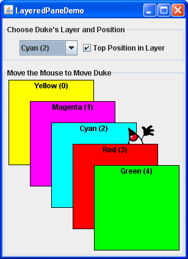

# JLayeredPane

## 简介

`JLayeredPane` 是 Swing 容器，提供了组件位置的第三个维度：*depth*，也称为 *z-order*。

将组件添加到 layered-pane，可以指定其深度（integer）:

- 数值越高，越靠近容器的顶部
- 组件重叠时，depth 值大的组件会覆盖 depth 小的组件
- 相同 depth 的组件，根据在该深度的位置确定

每个 Swing 容器都包含一个 root-pane，如 `JFrame`, `JDialog`, `JInternalFrame` 等，root-pane 中包含 layered-pane。大多程序不会显式使用 root-pane 的 layered-pane，因此这里不做讨论。在 [JRootPane](JRootPane.md) 中有相关细节。下面讨论如何直接使用 layered-pane。

Swing 提供了两个 layered-pane 类：

- JLayeredPane，是 root-pane 使用的类
- JDesktopPane，为 JLayeredPane 的子类，专门用于 JInternalFrame

下面创建一个 layered-pane，并在不同深度放置重叠的彩色 labels：

## 参考

- https://docs.oracle.com/javase/tutorial/uiswing/components/layeredpane.html