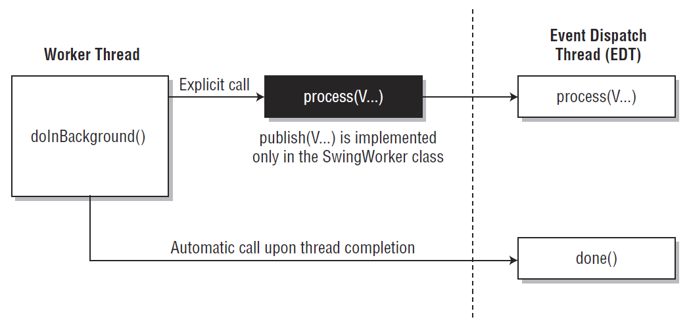

# Swing 并发

- [Swing 并发](#swing-并发)
  - [线程模式](#线程模式)
  - [Timer](#timer)
  - [SwingWorker](#swingworker)

## 线程模式

Swing 的线程模式规则：EDT负责执行任何修改组件的方法。Swing 不是一个线程安全的API，它应该只在 EDT 中调用。

`javax.swing.SwingUtilities` 类提供了三个处理 EDT 的方法：

- `invokeLater` 用于在 EDT 中发布一个新任务，并让它排队等待；
- `isEventDispatchThread()`，判断当前线程是否为 EDT 线程；
- `invokeAndWait()`类似于 `invokeLater()`。

`invokeAndWait` 方法使用较少，它和 `invokeLater` 一样，可以发布新任务到 EDT，区别在于 `invokeAndWait` 会阻塞当前线程，直到 EDT 完成发布的任务。

假设我们有一个程序可以检测读取文件是否超时。该程序在一个单独的线程读取文件，并在10秒后询问用户是继续还是取消操作。要实现这个特性，通常需要初始化一个锁来停止读文件线程，然后在 EDT 中显示一个对话框。

编写这段代码是可能的，但是很危险，容易引入死锁。下面展示如何使用 `invokeAndWait()` 安全地完全该任务：

```java
try {
    final int[] answer = new int[1];
    SwingUtilities.invokeAndWait(() -> answer[0] =
            JOptionPane.showConfirmDialog(SwingThreadingWait.this,
                    "Abort long operation?",
                    "Abort?",
                    JOptionPane.YES_NO_OPTION));
    if (answer[0] == JOptionPane.YES_OPTION) {
        return;
    }
} catch (InterruptedException e1) {
} catch (InvocationTargetException e1) {
}
```

需要知道，`invokeAndWait` 可能导致死锁。如果调用代码持有 `invokeAndWait` 调用中所需的锁，则 EDT 代码会等待 non-EDT 代码释放该锁，但这是不可能的，因为 non-EDT 代码在等待 EDT 代码完成，倒是程序挂起。

一般来说，`invokeAndWait` 用起来比 `invokeLater` 更简单，因为它是同步执行 `Runnable` 任务，似乎也不需要担心多个线程同时执行。不过一定要明确正在创建的线程和锁的依赖关系，确保无死锁出现。

除了三个工具方法，每个 Swing 组件提供了两个可以在任何线程调用的方法：`repaint()` 和 `revalidate()`。

- `revalidate` 强制一个组件布置它的子组件；
- `repaint` 单纯的刷新显示。

两个方法都是在 EDT 上执行，不管在哪个线程调用它们。

`repaint` 方法在 Swing 中使用十分广泛，用来同步组件的属性和屏幕展示。例如，调用 `JButton.setForeground(Color)` 更改按钮的前景色，Swing 会存储新颜色，并调用 `repaint()` 显示新颜色。调用 `repaint()` 会触发 EDT 上其它几个方法的执行，包括 `paint()` 和 `paintComponent()`。

## Timer

Java 提供了两种执行定时任务的方法：`java.util.Timer` 和 `javax.swing.Timer`。两个类都使用计时器线程提供类似的功能。

例如，下面使用 `java.util.Timer` 实现每 3 秒修改按钮颜色：

```java
java.util.Timer clown = new java.util.Timer();
clown.schedule(new TimerTask()
{
    public void run()
    {
        SwingUtilities.invokeLater(new Runnable()
        {
            public void run()
            {
                button.setForeground(getRandomColor());
            }
        });
    }
}, 0, 3000); // delay, period
```

`java.util.Timer` 可以调度多个 `TimerTask`，每个 `TimerTask` 具有不同的时间间隔。也可以随时取消 `TimerTask`。`java.util.Timer` 的主要问题是不再 EDT 上执行。由于 UI 很少需要能够一次处理数百个任务的高精度计时器，因此不如使用 `javax.swing.Timer`。

`javax.swing.Timer` 和 Swing 集成更好。一个 `Timer` 支持多个任务，都具有相同的重复周期。下面使用 `javax.swing.Timer` 重写上面的例子：

```java
javax.swing.Timer clown = new javax.swing.Timer(3000,
        new ActionListener()
        {
            public void actionPerformed(ActionEvent evt)
            {
                button.setForeground(getRandomColor());
            }
        });
clown.start();
```

Swing timer 在 EDT 上执行。

Timer 选择：

- 需要更新UI 时使用 `javax.swing.Timer`；
- 周期执行后台操作时使用 `java.util.Timer`。

## SwingWorker

`SwingUtilities` 对确保程序平稳、正确运行十分有用，但是需要创建大量的匿名 `Runnable` 类，常使得代码难以阅读和维护。为了解决该问题，Swing 团队创建了 `SwingWorker`，它简化了创建需要更新用户界面的耗时任务。使用 `SwingWorker` 可以在后台线程执行特定任务，在 EDT 上更新结果。

下面我们来看一个简单的用例以更好理解 `SwingWorker`。假设我们要从硬盘加载图像，并在 UI 显示这些图像。为了避免阻塞 UI，需要将加载图像放在后台线程。

同时，我们希望通过显示已加载图像的名称，向用户展示进度信息。当后台线程完成时，要求返回它加载的图像列表。要在 `SwingWorker` 实现该任务，需要继承 `SwingWorker` 并覆盖 `doInBackground()` 方法。

`SwingWorker` 是泛型类，有两个泛型参数 `T` 和 `V`。`T` 是 `doInBackground()` 的返回值，`V` 是中间值类型，可以使用 `publish(V...)` 发送到 EDT。然后 `SwingWorker` 在 EDT 上调用 `process(V...)` 方法。需要覆盖 `process` 方法从而在 GUI 上显示中间值。任务完成后，`SwingWorker` 在 EDT 上调用 `done()` 方法。

通常还会覆盖 `done()` 方法以显示最终结果。`doInBackground()` 完成后，`SwingWorker` 会自动在 EDT 中调用 `done()`。在 `done()` 中，可以使用 `get()` 方法获得 `doInBackground` 的返回值。



下面是载入图像的 `SwingWorker` 实现：

```java
public class ImageLoadingWorker extends SwingWorker<List<Image>, String>
{
    private JTextArea log;
    private JPanel viewer;
    private String[] filenames;

    public ImageLoadingWorker(JTextArea log, JPanel viewer, String... filenames)
    {
        this.log = log;
        this.viewer = viewer;
        this.filenames = filenames;
    }

    // EDT 中执行：doInBackground() 结束后，使用 get() 获得图像列表
    @Override
    protected void done()
    {
        try {
            for (Image image : get()) {
                viewer.add(new JLabel(new ImageIcon(image)));
                viewer.revalidate();
            }
        } catch (Exception e) {}
    }

    // In the EDT
    @Override
    protected void process(List<String> messages)
    {
        for (String message : messages) {
            log.append(message);
            log.append("\n");
        }
    }

    // 后台线程执行，载入图像
    @Override
    public List<Image> doInBackground()
    {
        List<Image> images = new ArrayList<Image>();
        for (String filename : filenames) {
            try {
                images.add(ImageIO.read(new File(filename)));
                publish("Loaded " + filename); // 分布中间结果
            } catch (IOException ioe) {
                publish("Error loading " + filename);
            }
        }
        return images;
    }
}
```


